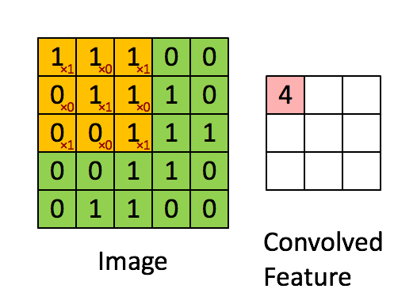
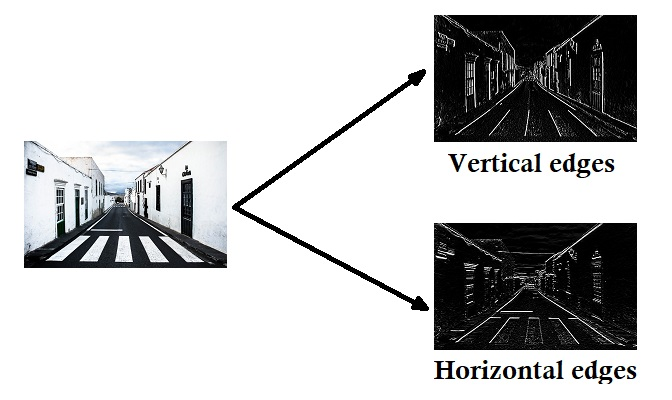
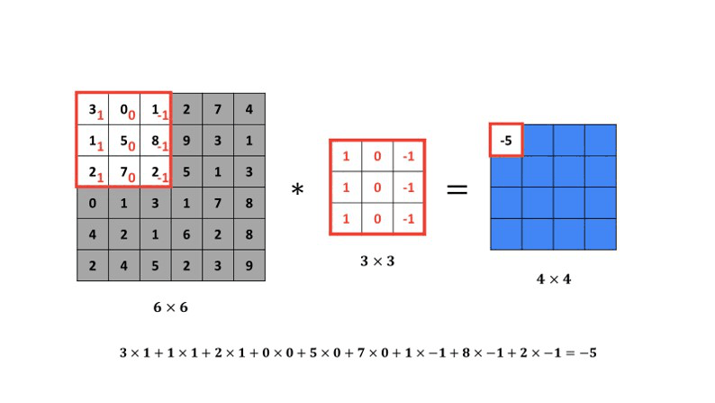

# Convolutional Layer

The main operation in a convolutional layer is the **convolution**:

1. This $3\times3$ _(or $5\times5$)_ filter slides over the input image, one patch at a time _(usually moving one pixel at a time, called a stride of 1)_.
2. At each position, it performs an **element-wise multiplication** between the filter values and the corresponding pixel values in the image patch.
3. It sums all the results to produce a single output value.
4. We add a **bias** term to this sum (just like in regular NNs).
5. That single number is placed in a new grid, called a **feature map** or **activation map**.



This feature map **lights up** _(has high values)_ in the areas where the filter found the specific pattern it was looking for.

So the feature map simply is just a new image that shows where the filter detected the pattern in the original image.



Here's an illustration of how the filter _(vertical edges)_ moves across a small $6\times6$ image:



### Filters

These filters are just small $3\times3$ or $5\times5$ matrices of numbers **(weights)**. The values of these numbers determine what pattern the filter will _detect_ or _get excited by_.

Let's look at a few simple, **man-made** examples for intuition:

- **Vertical Edge Filter**:

$$
\begin{bmatrix}
1 & 0 & -1 \\
1 & 0 & -1 \\
1 & 0 & -1
\end{bmatrix}
$$

- **Horizontal Edge Filter**:

$$
\begin{bmatrix}
1 & 1 & 1 \\
0 & 0 & 0 \\
-1 & -1 & -1
\end{bmatrix}
$$

- **Sharpness Filter (outline detector)**:

$$
\begin{bmatrix}
-1 & -1 & -1 \\
-1 & 8 & -1 \\
-1 & -1 & -1
\end{bmatrix}
$$

:::info Note
We do not have to design these filters by hand!

When we create a new convolutional layer, we are just creating a set of filters _(e.g., 32 filters)_ with **random values**.

During training, as the network learns, **backpropagation** automatically and slowly adjusts the numbers in these filters. The network discovers on its own that *vertical edges* and *horizontal edges* are useful patterns for telling a '1' from a '7'. or a '3' from an '8'.

---

The filters in the first convolutional layer learn **simple** patterns _(edges, corners, gradients)_. The filters in deeper layers then look at the _feature maps_ from the first layer and learn to combine those simple patterns into more **complex** ones _(like 'an eye', 'a wheel', or a '9')_.
:::

### Backpropagation

Backpropagation in convolutional layers works similarly to that in dense layers, but with some differences due to the spatial structure of the data and the shared weights of the filters.

During backpropagation in this layer, we need to compute 3 gradients:
1. $db$: Gradient w.r.t the biases _(easy)_
2. $dW$: Gradient w.r.t the filters' weights _(a bit tricky)_
3. $dA_{prev}$: Gradient w.r.t the input of the layer _(to pass to the previous layer)_, _(hardest part)_

We do receive the $dA$ from the next pooling layer and we have our cached values from the forward pass: the input $A_{prev}$, our filters $W$, biases $b$, convs $Z$, stride, and padding.

First let's find $dZ$:

$$
A = ReLU(Z) \Rightarrow dZ = dA * ReLU'(Z) = dA * (Z > 0)
$$

This one basically just zeros out the gradients where $Z$ was negative (since ReLU is 0 there). So we end with $dZ$ same value as $dA$ but with zeros where $Z$ was negative.

For $db$, we have:

$$
Z = conv(A_{prev}, W) + b \Rightarrow db = \sum_{i=1}^{m} \sum_{h=1}^{H_{out}} \sum_{w=1}^{W_{out}} dZ[i, h, w, c]
$$

<details>
<summary>Click to understand why we used the summation over $m, H_out, W_out$</summary>

This is because each bias $b_c$ is added to every single output in the feature map $Z[:, :, :, c]$. So to get the gradient w.r.t that bias, we just sum up all the gradients coming from that feature map.

In other words, $b_c$ affects every position in the output feature map for filter $c$, so we accumulate the gradients from all those positions to get the total gradient for that specific bias.
</details>

For $dW$, for a specific filter $c$ we have:

$$
Z[h, w, c] = X_{slice} \cdot W_c + b_c \Rightarrow dW_c = dZ \cdot X_{slice}
$$

Thus, to compute the $dW_c$ we must **convolve** the input $A_{prev}$ with the $dZ$. In other words:

$$
dW_c = conv(A_{prev}, dZ_c)
$$

Now for $dA_{prev}$, we need to figure out how much each pixel in the input contributed to the output $Z$. Each pixel in $A_{prev}$ affects multiple outputs in $Z$ because of the sliding nature of the convolution.

We know that:

$$
Z = conv(A_{prev}, W) + b
$$

For a slice of $A_{prev}$ that produced $Z[h, w, c]$, we have:

$$
Z[h, w, c] = X_{slice} \cdot W_c + b_c
$$

Thus:

$$
dZ/dX_{slice} = W_c
$$

Thus:

$$
dX_{slice} = dZ[h, w, c] * W_c
$$

How to compute $dA_{prev}$ overall?
1. Initialize $dA_{prev}$ with zeros, having the same shape as $A_{prev}$.
2. For each scalar $dZ[h, w, c]$, compute the corresponding slice in $A_{prev}$ that contributed to it.
3. Multiply $dZ[h, w, c]$ with the filter $W_c$ to get $dX_{slice}$.
4. Add $dX_{slice}$ to the appropriate location in $dA_{prev}$.
5. Repeat this for all positions $(h, w)$ and all filters $c$.

Mathematically:

$$
dA_{prev}[h_{start}:h_{end}, w_{start}:w_{end}, :] += dZ[h, w, c] * W_c
$$

This operation is called **transposed convolution** or **full convolution** because we are effectively reversing the convolution operation to distribute the gradients back to the input space.


## Python Implementation

Here is a simplified Python implementation of the forward and backward pass for a convolutional layer using NumPy:

```python title="conv_layer.py"
import numpy as np

class Conv_Layer:
    def __init__(self, in_channels, num_filters, filter_size, stride=1, padding=0):
        '''
        in_channels: Depth of the input volume (e.g., 1 for grayscale, 3 for RGB)
        num_filters: Number of filters to use (this will be the depth of the output volume)
        filter_size: An integer, e.g., 3 for a 3x3 filter
        stride: Step size of the filter
        padding: The amount of zero-padding to add to the input
        '''
        self.C = num_filters
        self.F = filter_size
        self.S = stride
        self.P = padding

        # 1. Initialize the filters with random weights and biases
        self.filters = np.random.randn(self.F, self.F, in_channels, self.C) * 0.1
        # one bias per filter
        self.biases = np.zeros((1, 1, 1, self.C))

    def _zero_pad(self, X, pad):
        '''
        Helper function to add zero-padding to a batch of images X
        X: Input data of shape (m, H, W, C)
        '''
        if self.P > 0:
            return np.pad(X, ((0, 0), (pad, pad), (pad, pad), (0, 0)), 'constant', constant_values=0)
        return X

    def _relu(self, Z):
        '''
        ReLU activation function
        '''
        return np.maximum(0, Z)
    
    def _relu_derivative(self, Z):
        '''
        Derivative of ReLU
        '''
        dZ = np.array(Z, copy=True)
        dZ[Z <= 0] = 0
        dZ[Z > 0] = 1
        return dZ

    def forward_pass(self, A_prev):
        '''
        A_prev: Input data from the previous layer
            Shape: (m, H_prev, W_prev, C_prev)
            m: batch size
            H_prev: height of input
            W_prev: width of input
            C_prev: number of channels in input

        Returns:
        A: Output of the layer (after activation)
        cache: A tuple of values needed for backward pass
        '''

        # 1. Get dimensions
        m, H_prev, W_prev, C_prev = A_prev.shape
        # _, F, _, C_out = self.filters.shape # No need

        # 2. Compute output dimensions of the conv layer
        # (H - F + 2P) / S   + 1
        H_out = int((H_prev - self.F + 2 * self.P) / self.S) + 1
        W_out = int((W_prev - self.F + 2 * self.P) / self.S) + 1

        # 3. Apply padding to the input
        X_padded = self._zero_pad(A_prev, self.P)

        # 4. Initialize output volume Z
        Z = np.zeros((m, H_out, W_out, self.C))

        # 5. --- The Convolution Loop ---
        for i in range(m):  # loop over batch size
            x_i = X_padded[i]  # ith input image

            for h in range(H_out):
                for w in range(W_out):
                    # find the corners of the current 3D slice
                    h_start = h * self.S
                    h_end = h_start + self.F
                    w_start = w * self.S
                    w_end = w_start + self.F
                    x_slice = x_i[h_start:h_end, w_start:w_end, :]

                    # convolve with all filters
                    for c in range(self.C): # loop over filters
                        # Element-wise multiplication, then sum all 3 dimensions
                        conv_sum = np.sum(x_slice * self.filters[:, :, :, c])

                        # Add bias
                        Z[i, h, w, c] = conv_sum + self.biases[0, 0, 0, c]

        # 6. Apply ReLU activation
        A = self._relu(Z)

        # 7. Store values for backward pass
        # we will need X_prev and our parameters to calculate gradients later
        cache = (A_prev, Z, self.filters, self.biases, self.S, self.P)

        return A, cache

    def backpropagation(self, dA, cache):
        '''
        dA: Gradient w.r.t the output (A), shape: (m, H_out, W_out, C_out)
        cache: Tuple of values from forward pass

        Returns:
        dA_prev: Gradient w.r.t the input (A_prev), shape: (m, H_prev, W_prev, C_prev)
        dW: Gradient w.r.t the filters (weights), shape: (F, F, C_prev, C_out)
        db: Gradient w.r.t the biases
        '''

        # 1. Unpack cache
        (A_prev, Z, W, b, S, P) = cache
        # 2. Get dimensions
        (m, H_prev, W_prev, C_prev) = A_prev.shape
        (_, H_out, W_out, C_out) = dA.shape
        (F, _, _, _) = W.shape

        # 3. Initialize gradients
        dA_prev = np.zeros_like(A_prev)  # (m, H_prev, W_prev, C_prev)
        dW = np.zeros_like(W)            # (F, F, C_prev, C_out)
        db = np.zeros_like(b)            # (1, 1, 1, C_out)

        # 4. Calculate dZ
        dZ = dA * self._relu_derivative(Z)  # (m, H_out, W_out, C_out)

        # 5. Pad A_prev and dA_prev
        A_prev_padded = self._zero_pad(A_prev, P)
        dA_prev_padded = self._zero_pad(dA_prev, P)

        # 6. --- The Backpropagation Loop ---
        for i in range(m):
            x_padded_i = A_prev_padded[i]
            da_prev_padded_i = dA_prev_padded[i]

            for h in range(H_out):
                for w in range(W_out):
                    for c in range(C_out):
                        # Corners
                        h_start = h * S
                        h_end = h_start + F
                        w_start = w * S
                        w_end = w_start + F

                        # Slice of A_prev_padded
                        x_slice = x_padded_i[h_start:h_end, w_start:w_end, :]
                        dz = dZ[i, h, w, c]

                        # Calculate gradients
                        # 1. --- dA_prev (Transposed Convolution) ---
                        da_prev_padded_i[h_start:h_end, w_start:w_end, :] += W[:, :, :, c] * dz

                        # 2. --- dW (Convolution with input) ---
                        dW[:, :, :, c] += x_slice * dz

                        # 3. --- db (Sum) ---
                        db[:, :, :, c] += dz

            # Unpad dA_prev
            if P > 0:
                dA_prev[i, :, :, :] = da_prev_padded_i[P:-P, P:-P, :]
            else:
                dA_prev[i, :, :, :] = da_prev_padded_i

        self.dW = dW / m
        self.db = db / m

        return dA_prev, self.dW, self.db

    def update_parameters(self, learning_rate):
        self.filters -= learning_rate * self.dW
        self.biases -= learning_rate * self.db
```

:::tip ReLU being the Standard for Convolutional Layers
In practice, ReLU is the most commonly used activation function after convolutional layers due to its simplicity and effectiveness in mitigating the vanishing gradient problem. While other activation functions like Leaky ReLU, ELU, or SELU can be used, ReLU remains the default choice in most CNN architectures.
:::