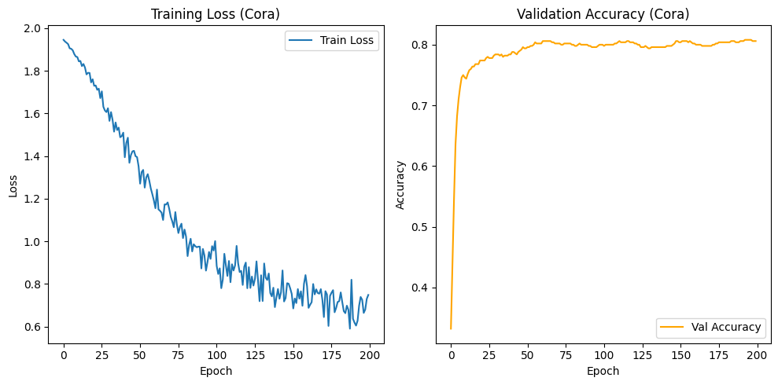

# GAT First Application

## Prerequisites

- [GAT](./gat.md)
- [Python](https://www.python.org/)
- [PyTorch Geometric](https://pytorch-geometric.readthedocs.io/en/latest/)

## Dataset

We will use the **Cora** dataset from _Planetoid_. It is a citation network of scientific papers, where nodes represent papers and edges represent citations.

## GAT Layer

```python title="GAT Layer"
class GATConv(nn.Module):
    '''
    Multi-head GAT layer
    '''
    def __init__(self, in_feats, out_feats, heads=8, alpha=0.2, dropout=0.6, concat=True):
        super(GATConv, self).__init__()
        self.in_feats = in_feats
        self.out_feats = out_feats
        self.alpha = alpha
        self.heads = heads
        self.dropout_rate = dropout
        self.concat = concat

        # Trainable parameters
        _w_size = (in_feats, heads * out_feats)
        _wa_size = (heads, 2 * out_feats)
        self.W = nn.Parameter(torch.zeros(size=_w_size))
        self.Wa = nn.Parameter(torch.zeros(size=_wa_size))

        # Initialize weights (Xavier/Glorot)
        nn.init.xavier_uniform_(self.W.data, gain=1.414)
        nn.init.xavier_uniform_(self.Wa.data, gain=1.414)

        # LeakyReLU
        self.leakyrelu = nn.LeakyReLU(self.alpha)

    def forward(self, h, adj):
        # 1. linear transformation
        N = h.size(0)

        h_prime = torch.mm(h, self.W) # (N, heads * out_feats)
        # separate heads
        h_prime = h_prime.view(N, self.heads, self.out_feats)

        # 2. attention score
        a_src = self.Wa[:, :self.out_feats]
        a_dst = self.Wa[:, self.out_feats:]

        # compute energy for src and dst
        e_src = (h_prime * a_src.unsqueeze(0)).sum(dim=-1) # unsqueeze(0) it is 0 to broadcast the operation
        e_dst = (h_prime * a_dst.unsqueeze(0)).sum(dim=-1)

        # broadcast to get all pairs (N, N, heads)
        # e[i, j, h] = e_src[i, h] + e_dst[j, h]
        e = e_src.view(N, 1, self.heads) + e_dst.view(1, N, self.heads)
        e = self.leakyrelu(e)

        # 3. mask
        # adj is (N, N), unsqueeze to (N, N, 1) to broadcast over heads
        zero_vec = -9e15 * torch.ones_like(e)
        attention = torch.where(adj.unsqueeze(-1) > 0, e, zero_vec)

        # 4. softmax and dropout
        attention = F.softmax(attention, dim=1)
        attention = F.dropout(attention, p=self.dropout_rate, training=self.training)

        # 5. aggregation
        # premute to batch matrix multiplication (heads, N, N) @ (heads, N, out_feats)
        attention = attention.permute(2, 0, 1)
        h_prime = h_prime.permute(1, 0, 2)

        h_new = torch.bmm(attention, h_prime)

        # 6. combine heads
        if self.concat:
            return h_new.permute(1, 0, 2).contiguous().view(N, self.heads * self.out_feats), attention
        else:
            # average
            return h_new.mean(dim=0), attention


```

## GAT Model

Now we build our **GAT** model.

```python title="GAT Model"
class GAT(nn.Module):
    def __init__(self, nfeat, nhid, nclass, nheads=8, alpha=0.2, dropout=0.6):
        super(GAT, self).__init__()
        torch.manual_seed(42)
        self.dropout = dropout

        self.att1 = GATConv(nfeat, nhid, nheads, alpha, dropout)
        self.att2 = GATConv(nhid * nheads, nclass, 1, alpha, dropout, concat=False)

    def forward(self, x, adj):
        # layer 1
        x = F.dropout(x, p=self.dropout, training=self.training)
        x, _ = self.att1(x, adj)
        x = F.elu(x)
        # layer 2
        x = F.dropout(x, p=self.dropout, training=self.training)
        x, attention_weights = self.att2(x, adj)

        return F.log_softmax(x, dim=1)
```

## Training

Let's build the function to train the model.

```python title="Training Function"
def train_model():
    features, adj, labels, idx_train, idx_val, idx_test = get_data(cora_graph)
    if features is None:
        return
    adj = adj + torch.eye(adj.shape[0])
    # Clamp to max 1 (in case self-loops already existed)
    adj = torch.where(adj > 0, torch.ones_like(adj), torch.zeros_like(adj))

    # --- Configuration
    NUM_NODES = features.shape[0]
    NUM_FEATURES = features.shape[1]
    NUM_CLASSES = int(labels.max()) + 1
    NUM_HIDDEN = 8
    NUM_HEADS = 8

    LR = 0.005
    WEIGHT_DECAY = 5e-4 # L2 regularization
    EPOCHS = 200

    # --- Model Setup
    model = GAT(nfeat=NUM_FEATURES, nhid=NUM_HIDDEN, nclass=NUM_CLASSES, nheads=NUM_HEADS)

    optimizer = optim.Adam(model.parameters(), lr=LR, weight_decay=WEIGHT_DECAY)

    # --- Training
    loss_history = []
    val_acc_history = []

    print("\nStarting Multi-Head Training")
    model.train()

    for epoch in range(EPOCHS):
        optimizer.zero_grad()

        # forward pass
        output = model(features, adj)

        # loss only on training nodes
        loss = F.nll_loss(output[idx_train], labels[idx_train])

        # backword pass
        loss.backward()
        optimizer.step()

        # val acc
        model.eval()
        with torch.no_grad():
            output_val = model(features, adj)
            pred_val = output_val[idx_val].max(1)[1]
            acc_val = pred_val.eq(labels[idx_val]).sum().item() / idx_val.size(0)

        model.train()

        loss_history.append(loss.item())
        val_acc_history.append(acc_val)

        if (epoch + 1) % 20 == 0:
            print(f"Epoch {epoch+1:03d} | Loss: {loss.item():.4f} | Val Acc: {acc_val:.4f}")

    print("\nTraining Complete")

    # --- Testing
    model.eval()
    output_test = model(features, adj)
    pred_test = output_test[idx_test].max(1)[1]
    acc_test = pred_test.eq(labels[idx_test]).sum().item() / idx_test.size(0)

    print(f"Test Accuracy: {acc_test:.4f}")

    # --- Vis
    plt.figure(figsize=(10, 5))
    plt.subplot(1, 2, 1)
    plt.plot(loss_history, label='Train Loss')
    plt.title('Training Loss (Cora)')
    plt.xlabel('Epoch')
    plt.ylabel('Loss')
    plt.legend()

    plt.subplot(1, 2, 2)
    plt.plot(val_acc_history, color='orange', label='Val Accuracy')
    plt.title('Validation Accuracy (Cora)')
    plt.xlabel('Epoch')
    plt.ylabel('Accuracy')
    plt.legend()

    plt.tight_layout()
    plt.show() # Will display plot in standard environments
    print("Training complete. Visualization generated.")

```

## Output


```
Starting Multi-Head Training
Epoch 020 | Loss: 1.7604 | Val Acc: 0.7740
Epoch 040 | Loss: 1.5101 | Val Acc: 0.7840
Epoch 060 | Loss: 1.1914 | Val Acc: 0.8020
Epoch 080 | Loss: 1.0555 | Val Acc: 0.8000
Epoch 100 | Loss: 1.0014 | Val Acc: 0.8000
Epoch 120 | Loss: 0.9007 | Val Acc: 0.8040
Epoch 140 | Loss: 0.7364 | Val Acc: 0.7960
Epoch 160 | Loss: 0.7899 | Val Acc: 0.8020
Epoch 180 | Loss: 0.7160 | Val Acc: 0.8040
Epoch 200 | Loss: 0.7489 | Val Acc: 0.8060

Training Complete
Test Accuracy: 0.8210
Training complete. Visualization generated.
```

