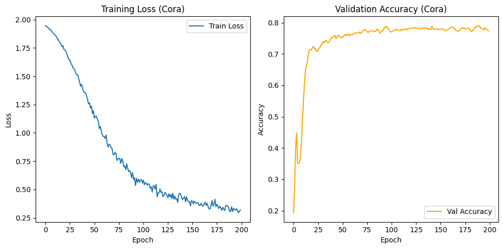

# GCN First Application

## Prerequisites

- [GCN](./gcn.md)
- [Python](https://www.python.org/)
- [PyTorch Geometric](https://pytorch-geometric.readthedocs.io/en/latest/)

## Dataset

We will use the **Cora** dataset from _Planetoid_. It is a citation network of scientific papers, where nodes represent papers and edges represent citations.

```python title="Loading the dataset"
from torch_geometric.datasets import Planetoid
from torch_geometric.transforms import NormalizeFeatures

cora_dataset = Planetoid(root='Cora_data', name='Cora', transform=NormalizeFeatures())
len(cora_dataset) # it's only a single graph

cora_dataset.num_features # 1433 features for each node
cora_graph = cora_dataset[0]
cora_graph

cora_graph.x[0]

print(f"Training samples: {cora_graph.train_mask.sum().item()}")
print(f"Validation samples: {cora_graph.val_mask.sum().item()}")
print(f"Test samples: {cora_graph.test_mask.sum().item()}")

print(f"Number of nodes: {cora_graph.num_nodes}")
print(f"Number of edges: {cora_graph.num_edges}")
print(f"Avg node degree: {cora_graph.num_edges / cora_graph.num_nodes:.2f}")
print(f"Has isolated nodes: {cora_graph.has_isolated_nodes()}")
print(f"Has self-loops: {cora_graph.has_self_loops()}")
print(f"Is undirected: {cora_graph.is_undirected()}")

print(f"Number of classes: {cora_dataset.num_classes}")

# let's give names to these classes
classes_dict = {
    0: 'Theory',
    1: 'RL',
    2: 'Genetic_Algorithms',
    3: 'Neural_Networks',
    4: 'Probabilistic_Methods',
    5: 'Case_Based',
    6: 'Rule_Learning',
}

cora_graph.y[:10]

import collections
import matplotlib.pyplot as plt
from torch_geometric.utils import to_dense_adj

counter = collections.Counter(cora_graph.y.numpy())
counter = dict(counter)
print(counter)

count = [(classes_dict[x[0]],x[1]) for x in sorted(counter.items())]

plt.figure(figsize=(8, 6))
plt.bar([x[0] for x in count], [x[1] for x in count])
plt.xlabel('Classes', size=12)
plt.ylabel('Count')
plt.title('Class Distribution')
plt.show()

import networkx as nx
from torch_geometric.utils import to_networkx

colorlist = ['#1f77b4', '#ff7f0e', '#2ca02c', '#d62728', '#9467bd', '#8c564b', '#e377c2']

# convert PyG graph to NetworkX graph
G = to_networkx(cora_graph, to_undirected=True)

# node colors
node_color = [colorlist[int(label)] for label in cora_graph.y]
labellist = [classes_dict[int(label)] for label in cora_graph.y]

# plot the graph
pos = nx.spring_layout(G, seed=42)
plt.figure(figsize=(12, 12))
nx.draw_networkx_nodes(G, pos, node_size=5, node_color=node_color)
nx.draw_networkx_edges(G, pos, width=0.25)

# legend
for label, color in zip(classes_dict.values(), colorlist):
    plt.scatter([], [], c=color, s=5, label=label)
plt.legend(bbox_to_anchor=(1, 1), loc='upper left')
plt.show()

def get_data(cora_graph):
    features = cora_graph.x
    labels = cora_graph.y

    adj = to_dense_adj(cora_graph.edge_index)[0]

    idx_train = torch.nonzero(cora_graph.train_mask, as_tuple=False).view(-1)
    idx_val = torch.nonzero(cora_graph.val_mask, as_tuple=False).view(-1)
    idx_test = torch.nonzero(cora_graph.test_mask, as_tuple=False).view(-1)

    return features, adj, labels, idx_train, idx_val, idx_test
```

## GCN Model

Now we build our **GCN** model.

```python title="Helper Functions"
import torch

def normalize_adjacency(adj):
    '''
    Applies the renormalization trick: D^(-1/2) (A + I) D^(-1/2)
    '''
    # 1. self-loop
    self_adj = adj + torch.eye(adj.shape[0])

    # 2. compute the degree matrix
    rowsum = torch.sum(self_adj, dim=1)

    # 3. D^(-1/2)
    rowsum_inv_sqrt = torch.pow(rowsum, -0.5)
    rowsum_inv_sqrt[torch.isinf(rowsum_inv_sqrt)] = 0.0

    # diagonal matrix from vector
    d = torch.diag(rowsum_inv_sqrt)

    # 4. compute the normalized adjacency
    norm_adj = torch.mm(torch.mm(d, self_adj), d)

    return norm_adj
```

```python title="Graph Convolution"
import torch.nn as nn
import torch.nn.functional as F

class GCNConv(nn.Module):
    '''
    Single Graph Convolution Layer
    Implements: H_out = Activation(Norm_Adj * H_in * W + Bias)
    '''
    def __init__(self, in_feats, out_feats):
        super(GCNConv, self).__init__()
        self.in_feats = in_feats
        self.out_feats = out_feats

        # Trainable Weight Matrix (F_in x F_out)
        self.W = nn.Parameter(torch.FloatTensor(in_feats, out_feats))
        self.b = nn.Parameter(torch.FloatTensor(out_feats)) # Optional, but good practice

        # Initialize parameters
        self.reset_parameters()

    def reset_parameters(self):
        # Xavier/Glorot initialization for better convergence
        nn.init.xavier_uniform_(self.W)
        nn.init.zeros_(self.b)

    def forward(self, feats, norm_adj_matrix):
        '''
        Args:
            feats: (N, F_in) node features
            norm_adj_matrix: (N, N) normalized adjacency matrix
        '''
        # 1. linear transformation
        support = torch.mm(feats, self.W)

        # 2. neighborhood aggregation
        output = torch.mm(norm_adj_matrix, support)

        # 3. bias
        return output + self.b

    def __repr__(self):
        '''
        Returns a string representation of the module
        '''
        return f'{self.__class__.__name__}({self.in_feats}, {self.out_feats})'
```

Now we build our **GCN** model.

```python title="GCN Model"
class GCN(nn.Module):
    def __init__(self, in_feats, out_feats, hidden_feats = 16, dropout = 0.5):
        torch.manual_seed(42)

        super().__init__()
        self.dropout = dropout
        self.conv1 = GCNConv(in_feats, hidden_feats)
        self.conv2 = GCNConv(hidden_feats, out_feats)

    def forward(self, x, adj):
        # layer 1
        x = F.relu(self.conv1(x, adj))
        # dropout
        x = F.dropout(x, self.dropout, training=self.training)
        # layer 2
        x = self.conv2(x, adj)

        # Softmax for classification
        return F.log_softmax(x, dim=1) # dim=1 means
```

Now let's train our model.

```python title="Training the Model"
import torch.optim as optim

def train_model():
    features, adj, labels, idx_train, idx_val, idx_test = get_data(cora_graph)
    if features is None:
        return

    # --- Configuration
    NUM_NODES = features.shape[0]
    NUM_FEATURES = features.shape[1]
    NUM_CLASSES = int(labels.max()) + 1
    NUM_HIDDEN = 16 # standard hidden size for cora

    LR = 0.01
    WEIGHT_DECAY = 5e-4 # L2 regularization
    EPOCHS = 200

    # adj normalization
    norm_adj = normalize_adjacency(adj)

    # --- Model Setup
    model = GCN(in_feats=NUM_FEATURES, out_feats=NUM_CLASSES, hidden_feats=NUM_HIDDEN)

    optimizer = optim.Adam(model.parameters(), lr=LR, weight_decay=WEIGHT_DECAY)

    # --- Training
    loss_history = []
    val_acc_history = []

    print("\nStarting Training")
    model.train()

    for epoch in range(EPOCHS):
        optimizer.zero_grad()

        # forward pass
        output = model(features, norm_adj)

        # loss only on training nodes
        loss = F.nll_loss(output[idx_train], labels[idx_train])

        # backword pass
        loss.backward()
        optimizer.step()

        # val acc
        model.eval()
        with torch.no_grad():
            output_val = model(features, norm_adj)
            pred_val = output_val[idx_val].max(1)[1]
            acc_val = pred_val.eq(labels[idx_val]).sum().item() / idx_val.size(0)

        model.train()

        loss_history.append(loss.item())
        val_acc_history.append(acc_val)

        if (epoch + 1) % 20 == 0:
            print(f"Epoch {epoch+1:03d} | Loss: {loss.item():.4f} | Val Acc: {acc_val:.4f}")

    print("\nTraining Complete")

    # --- Testing
    model.eval()
    output_test = model(features, norm_adj)
    pred_test = output_test[idx_test].max(1)[1]
    acc_test = pred_test.eq(labels[idx_test]).sum().item() / idx_test.size(0)

    print(f"Test Accuracy: {acc_test:.4f}")

    # --- Vis
    plt.figure(figsize=(10, 5))
    plt.subplot(1, 2, 1)
    plt.plot(loss_history, label='Train Loss')
    plt.title('Training Loss (Cora)')
    plt.xlabel('Epoch')
    plt.ylabel('Loss')
    plt.legend()

    plt.subplot(1, 2, 2)
    plt.plot(val_acc_history, color='orange', label='Val Accuracy')
    plt.title('Validation Accuracy (Cora)')
    plt.xlabel('Epoch')
    plt.ylabel('Accuracy')
    plt.legend()

    plt.tight_layout()
    plt.show() # Will display plot in standard environments
    print("Training complete. Visualization generated.")

train_model()
```

## Output

```

Starting Training
Epoch 020 | Loss: 1.7356 | Val Acc: 0.7200
Epoch 040 | Loss: 1.3643 | Val Acc: 0.7520
Epoch 060 | Loss: 0.9683 | Val Acc: 0.7620
Epoch 080 | Loss: 0.7517 | Val Acc: 0.7740
Epoch 100 | Loss: 0.5570 | Val Acc: 0.7700
Epoch 120 | Loss: 0.4809 | Val Acc: 0.7820
Epoch 140 | Loss: 0.4315 | Val Acc: 0.7800
Epoch 160 | Loss: 0.3785 | Val Acc: 0.7820
Epoch 180 | Loss: 0.3375 | Val Acc: 0.7820
Epoch 200 | Loss: 0.3188 | Val Acc: 0.7740

Training Complete
Test Accuracy: 0.8030
Training complete. Visualization generated.

```



## Notebook

Check the full notebook [here](https://gist.github.com/AhmedCoolProjects/4f181dbaf9961ff6c8391dab083cdd25).
