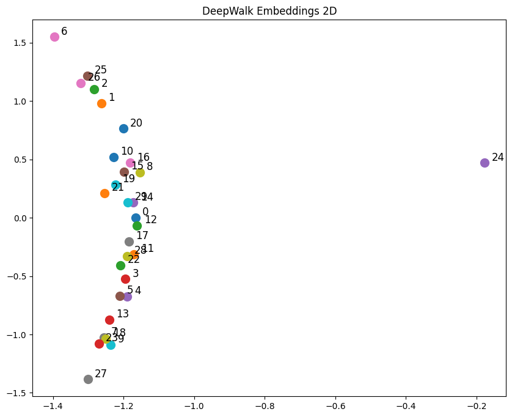

# Graph Embedding

Let's explore Graph Embedding. This requires a shift in how we think about data structure.

Until now, everything we've built _(CNNs, RNNs, Transformers)_ relies on **Euclidean data**.
- **Images**: Fixed grid of pixels. Neighbor 1 is always up, neighbor 2 is always right, etc.
- **Text**: Fixed sequence. Word $t$ is always followed by word $t+1$. 

## Graphs Data

**Size and Shape**

For graphs, the size _(number of nodes)_ or the number of neighbors _(degree)_ of each node can vary widely, it is not fixed like in images or text. Graphs are **Size Independent**.

**Isomorphism**

Two graphs are **isomorphic** if they have the same structure, even if the nodes are labeled differently. That leads to a different Adjacency Matrices. That's not the case for images or text, where the order of pixels or words identifies a totally different new image or text.

That's a reason why we can't use **Adjacency Matrices** directly as inputs for Neural Networks, since it is sensitive to the order of nodes.

**Graphs** are **Non-Euclidean**.

- **Social Networks**, **Molecules**, **Maps**: A node can have 1 neighbor or 1000. There's no "up", "down", or fixed order.

That's why in the Machine Learning area, we have the concept **Geometric Deep Learning** when it comes to **Graphs**.

---

Just like we converted words into dense vectors for **word embeddings**, our first goal with graphs is to convert **Nodes** into **Vectors**.

We want to learn a mapping function $f$:

$$
f: u \rightarrow \mathbb{R}^d
$$

Where $u$ is the node and $\mathbb{R}^d$ is the vector space.

:::info Golden Rule
If two nodes are "close" in the graph _(connected or share neighbors)_, their vectors should be "close" in the embedding space _(high dot product)_.
:::

## DeepWalk

**Word2Vec of Graphs**.

This technique was a huge breakthrough because it allowed researchers to take all the powerful tools built for language and apply them to graphs.

To use Word2Vec, we need a **corpus** _(a list of sentences)_. But a graph is a mess of connections, not a clean list of sentences.

**DeepWalk** converts a graph into sentences using **Random Walks**.
1. **Pick a starting node**
2. **Roll a die** to pick one of its neighbors at random
3. **Move to that neighbor**
4. **Repeat** for a fixed length _(e.g., 10 steps)_

The resulting path is treated exactly as a **sentence** of words.

**Why this works?**

In NLP, the **Distributional Hypothesis** states that words usually appearing in the same context have similar meanings.

In Graphs, we have **Homophily Hypothesis**: Nodes that are close to each other _(highly connected)_ arre likely to be similar.
- If Node A and Node B are connected, a random walker is very likely to step from A to B.
- They will appear next to each other in many random walks ("sentences").
- Word2Vec sees this and pushes their embedding vectors closer together _(maximizing their dot product)_.

---

**Data Size**

Suppose we have a small graph with **100 nodes**. We decide to generate a "corpus" with the following parameters:
- **Number of walks per node**: 5 _(We start 5 times from every single node)_
- **Walk length**: 10 steps.

This results in a corpus of $100 \times 5 = 500$ sentences.

### Python Implementation

```python title="Train DeepWalk"
import numpy as np
import random
import networkx as nx
from gensim.models import Word2Vec
import matplotlib.pyplot as plt

# --- 1. The graph data structure ---
# We'll use NetworkX to easily create and visualize a graph
def create_sample_graph():
    # Create a random graph with 3 clusters
    # This helps us visualize if the embeddings actually separate the clusters
    G = nx.fast_gnp_random_graph(n=30, p=0.1, seed=42)

    # Add some specific "bridge" edges to make it a bit more interesting
    G.add_edges_from([(0, 10), (10, 20)])
    return G

# --- 2. The Random Walker (DeepWalk Core) ---
def get_random_walk(graph, start_node, walk_length):
    """
    Generates a single random walk starting from start_node.
    """
    walk = [str(start_node)] # Stored as strings for Word2Vec
    curr_node = start_node

    for _ in range(walk_length - 1):
        # Get list of neighbors
        neighbors = list(graph.neighbors(curr_node))

        if len(neighbors) > 0:
            # Pick a random neighbor (Uniform Probability)
            next_node = random.choice(neighbors)
            walk.append(str(next_node))
            curr_node = next_node
        else:
            # Dead end: stop walking
            break

    return walk

def generate_walks(graph, num_walks, walk_length):
    """
    Generates the full 'corpus' of walks.
    num_walks: Number of walks to start from EACH node.
    """
    walks = []
    nodes = list(graph.nodes())

    print(f"Generating {num_walks} walks per node...")

    for _ in range(num_walks):
        random.shuffle(nodes)

        for node in nodes:
            walk = get_random_walk(graph, node, walk_length)
            walks.append(walk)

    return walks

# --- 3. Training the Embeddings ---
def train_deepwalk(walks, emb_size=16, window=5):
    """
    Uses Gensim's Word2Vec to learn embeddings from the walks.
    """
    # Initialize Word2Vec
    # sg=1: Use Skip-Gram (better for DeepWalk)
    # hs=1: Use Hierarchical Softmax (classic DeepWalk choice)
    model = Word2Vec(sentences=walks,
                    vector_size=emb_size,
                    window=window,
                    min_count=0,
                    sg=1,
                    hs=1,
                    workers=4,
                    epochs=10)
    return model
```

Now we can use it:

```python title="Using DeepWalk"
G = create_sample_graph()
print(f"Graph created with {len(G.nodes())} nodes and {len(G.edges())} edges")

NUM_WALKS = 10
WALK_LENGTH = 20

walks = generate_walks(G, NUM_WALKS, WALK_LENGTH)

print(f"Sample walk: {walks[0]}")

EMB_SIZE = 2 # small size for plotting
model = train_deepwalk(walks, emb_size=EMB_SIZE)

vec_0 = model.wv['0']
print(f"Embedding for node 0: {vec_0}")

print("Visualizing embeddings...")
plt.figure(figsize=(10, 8))

for node in G.nodes():
    vec = model.wv[str(node)]
    plt.scatter(vec[0], vec[1], s=100)
    plt.text(vec[0]+0.02, vec[1]+0.02, str(node), fontsize=12)

plt.title("DeepWalk Embeddings 2D")
plt.show()
```

#### Output

```
Graph created with 30 nodes and 54 edges
Generating 10 walks per node...
Sample walk: ['23', '13', '3', '29', '13', '3', '29', '3', '13', '18', '7', '28', '12', '17', '12', '8', '12', '17', '12', '5']
Embedding for node 0: [-1.1661105   0.00267051]
Visualizing embeddings...
```



:::note

DeepWalk did work as it is supposed to:
1. Identified **communities** _(the vertical clusters on the left)_
2. Identified **structural isolation** _(the outlier on the right)_
3. Mapped the discrete graph structure into a continuous vector space.

:::

### Notebook

Check the [DeepWalk.ipynb](https://gist.github.com/AhmedCoolProjects/2b7d227c7ebcd1596fc409397a993a76).

## Node2Vec

DeepWalk is like a drunk person stumbling around randomly. **Node2Vec** gives that walker a purpose. It introduces two parameters, $p$ and $q$, to bias the random walk. This allows the model to switch between two different strategies of exploring the graph:

### 1. BFS

**Breadth-First Search**: The walker stays local, exploring the immediate neighbors. It captures **Homophily** _(Community Structure)_. Nodes in the same cluster get similar embeddings.

### 2. DFS

**Depth-First Search**: The walker moves outward, exploring far away from the start. It captures **Structural Equivalence** _(Roles)_. Bridges, hubs, and outliers get similar embeddings, even if they are on opposite sides of the graph.

---

### The Steering Wheel

Suppose a walker just moved from $t$ to $v$, now it has to decide where to go next.

1. **Return Parameter ($p$)**: Likelihood of immediately returning to $t$. _(Encourages BFS/Local)_.

    $$
    p \text{ is Low} \implies \text{High Probability of going back to } t.
    $$

2. **In-Out Parameter ($q$)**: Likelihood of visiting a new node $x$ that is farther away from $t$. _(Encourages DFS/Global)_.

    $$
    q \text{ is Low} \implies \text{High Probability of going to a new node } x.
    $$

## Limitations

DeepWalk and Node2Vec are the **Shallow Embeddings**. They are powerful, but they have two major flaws that **Graph Neural Networks _(GNNs)_** were invented to fix.
1. **The "New User" Problem**: Imagine a new user joins the social network. They have no random walks yet. DeepWalk/Node2Vec have _no idea_ how to embed them until we re-train the whole model. _(This is called being **Transductive**)_.
2. **The "Feature" Problem**: DeepWalk only looks at connections. It ignores the fact that User A's profile says "likes football" and User B's profile says "Likes football". It only cares if they are friends.

## References

- [Node2Vec](https://arxiv.org/pdf/1607.00653) Paper.
