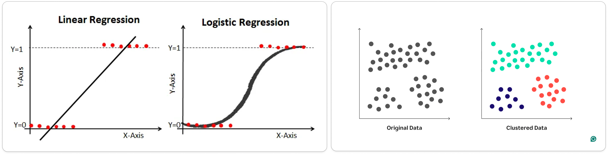
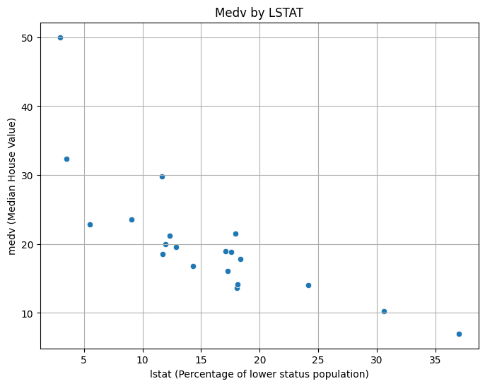
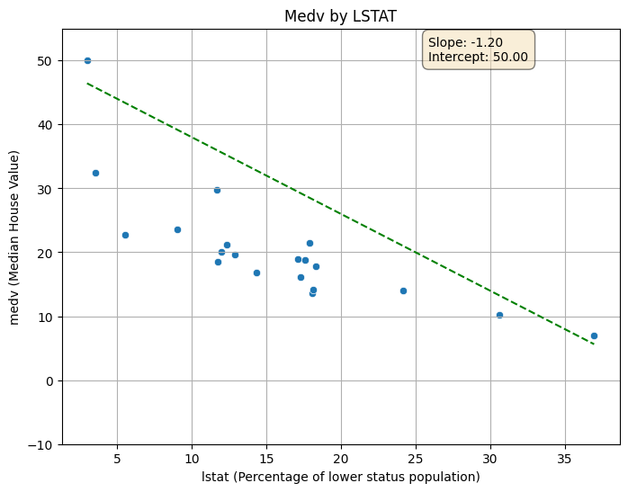
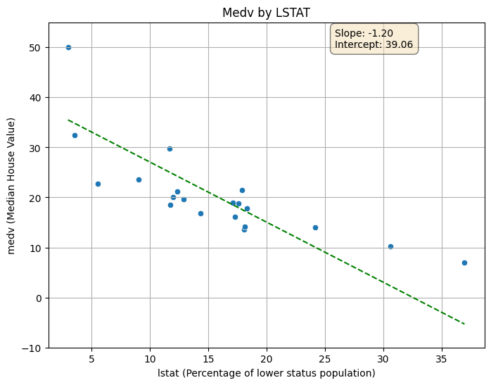
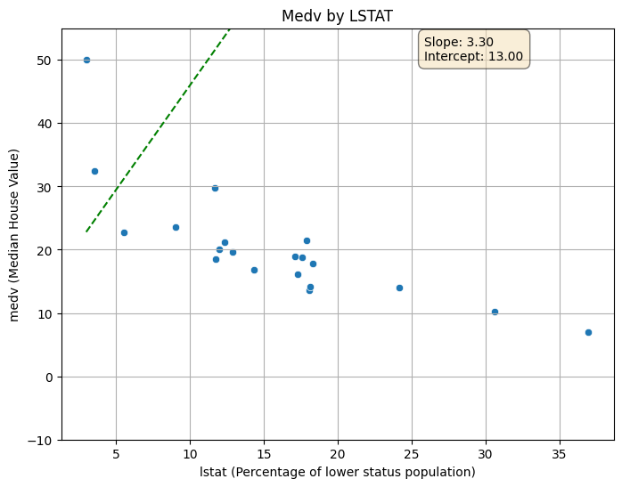
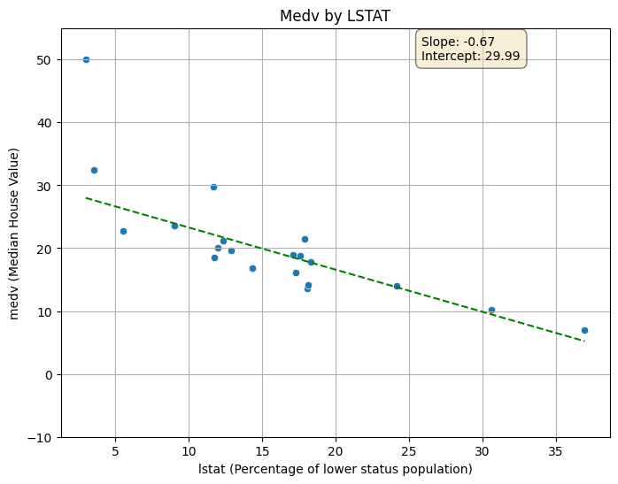

# Gradient Descent

In Statistics, Machine Learning and other Data Science fields, we **optimize** a lot of stuff. When we fit a line with Linear Regression, we optimize the line's **slope** and **intercept**. When we use Logistic Regression, we optimize a **squiggle** and when we use t-SNE, we optimize **clusters**.




Gradient Descent is an **Optimization Algorithm** used to minimize the loss function in machine learning models, including neural networks. It works by iteratively adjusting the model's parameters (weights and biases) in the direction that reduces the loss.

## 1. Linear Regression (Single Parameter)

**Situation**: We do have a sample of **20** data points from the [Boston Housing Dataset](https://raw.githubusercontent.com/selva86/datasets/master/BostonHousing.csv).

**Goal**: We want to fit a line through these points in a 2D space that best represents the relationship between the input variable _(Lower Status of the Population)_ and the output variable _(Median Value of Homes)_.



Since we are dealing with a simple linear regression problem, we want to fit a line to the data by optimizing a randomly initialized slope and intercept. For more simplicity, we do fix the **slop** to **-1.2** and we try to optimize the **intercept** only.



### Step 1: Define the Loss Function

To measure how well our line fits the data points, we need to define a **Loss Function**. A common choice for regression problems is the **Mean Squared Error (MSE)**, which calculates the average of the squares of the errors between the predicted and actual values. Also there's the **Sum of Squared Residuals (SSR)** which is the sum of the squared differences between the observed actual outcomes and the outcomes predicted by the model _(line)_.

**Decision**: We will use the **Sum of Squared Residuals (SSR)** as our loss function.

$$
SSR = \sum_{i=1}^{n} (y_i - \hat{y}_i)^2
$$

Where:

- $y_i$ is the actual value of the output variable for the $i^{th}$ data point.
- $\hat{y}_i$ is the predicted value from our line for the $i^{th}$ data point.
- $n$ is the total number of data points.

### Step 2: Calculate the Loss

We do have a first guess for the intercept, let's say **50**. Now we can calculate the predicted values for each data point using our line equation:

$$
\hat{y}_i = slope \times x_i + intercept
$$

And since the slope is fixed to -1.2, we can rewrite it as:

$$
\hat{y}_i = -1.2 \times x_i + intercept
$$

Where $x_i$ is the value of the input variable for the $i^{th}$ data point.

Let's create a function that calculates the _Residuals_ and then the _SSR_ based on a specified intercept.

```python title="Calculate SSR"
def calculate_ssr(data, intercept, slope=-1.2):
    ssr = 0
    for index, row in data.iterrows():
        x_i = row['lstat']
        y_i = row['medv']
        y_hat_i = slope * x_i + intercept
        residual = y_i - y_hat_i
        ssr += residual ** 2
    return ssr
```

<details>
  <summary>Real data points values vs. Predicted values by the current line</summary>

|lstat|${y}$|$\hat{y}$|
|---|---|---|
|9\.04|23\.6|39\.15|
|3\.53|32\.4|45\.76|
|18\.07|13\.6|28\.32|
|5\.52|22\.8|43\.38|
|17\.27|16\.1|29\.28|
|11\.97|20\.0|35\.64|
|18\.33|17\.8|28\.00|
|24\.16|14\.0|21\.01|
|12\.87|19\.6|34\.56|
|14\.33|16\.8|32\.80|
|17\.92|21\.5|28\.50|
|17\.1|18\.9|29\.48|
|36\.98|7\.0|5\.62|
|12\.34|21\.2|35\.19|
|11\.74|18\.5|35\.91|
|11\.66|29\.8|36\.01|
|17\.58|18\.8|28\.90|
|30\.62|10\.2|13\.25|
|2\.97|50\.0|46\.44|
|18\.13|14\.1|28\.24|

</details>

:::info SSR (Intercept = 50)
**3135.98**.
:::

### Step 3: Update the Intercept

To find a better fitting line, we need to update the intercept in a way it reduces the SSR loss. We can do this by calculating the gradient of the loss function with respect to the intercept. The gradient tells us how much the loss will change if we make a change to the intercept.

The gradient of the SSR with respect to the intercept can be calculated as follows:

First we know that:

$$
SSR = \sum_{i=1}^{n} (y_i - \hat{y}_i)^2
$$

and:

$$
\hat{y}_i = -1.2 \times x_i + intercept
$$

Applying the Chain Rule, we get:

$$
\frac{\partial SSR}{\partial intercept} = \frac{\partial SSR}{\partial \hat{y}_i} \times \frac{\partial \hat{y}_i}{\partial intercept}
$$

Then we calculate each part:

$$
\frac{\partial SSR}{\partial \hat{y}_i} = -2 \times (y_i - \hat{y}_i)
$$

$$
\frac{\partial \hat{y}_i}{\partial intercept} = 1
$$

Combining these, we get:

$$
\frac{\partial SSR}{\partial intercept} = -2 \times \sum_{i=1}^{n} (y_i - \hat{y}_i)
$$

Now that we have the **Gradient**, to update the intercept, we need to calculate the **Step Size**. The step size is determined by the **Learning Rate** (a small constant value) multiplied by the gradient.

**Decision**: We will use a learning rate of **0.001**.

Then: 

$$
Step\ Size = Learning\ Rate \times Gradient
$$

```python title="Calculate Gradient and Update Intercept"
def calculate_gradient(data, intercept, slope=-1.2):
    gradient = 0
    for index, row in data.iterrows():
        x_i = row['lstat']
        y_i = row['medv']
        y_hat_i = slope * x_i + intercept
        residual = y_i - y_hat_i
        gradient += -2 * residual
    return gradient

def update_intercept(intercept, gradient, learning_rate=0.001):
    step_size = learning_rate * gradient
    new_intercept = intercept - step_size
    return new_intercept
```

:::info Gradient & New Intercept (After 1st Update)
Gradient: **437.49**

New Intercept: **45.63**
:::

### Step 4: Iterate

We need to repeat the process of calculating the SSR, computing the gradient, and updating the intercept multiple times until the SSR converges to a minimum value or until we reach a predefined number of iterations or until the step size becomes very small.

```python title="Gradient Descent Loop"
def gradient_descent(data, initial_intercept, slope=-1.2, learning_rate=0.001, iterations=2000):
    intercept = initial_intercept
    for i in range(iterations):
        ssr = calculate_ssr(data, intercept, slope)
        gradient = calculate_gradient(data, intercept, slope)
        intercept = update_intercept(intercept, gradient, learning_rate)
        if i % 100 == 0:
            print(f"Iteration {i}: SSR = {ssr}, Intercept = {intercept}")
    return intercept
```

The output looks like this:

```
Iteration 0: SSR = 3135.980384, Intercept = 49.562512
Iteration 100: SSR = 744.2144159438118, Intercept = 39.23993349461594
Iteration 200: SSR = 743.5337009918546, Intercept = 39.065788298623325
Iteration 300: SSR = 743.5335072551545, Intercept = 39.06285041355212
Iteration 400: SSR = 743.5335072000156, Intercept = 39.06280085049273
Iteration 500: SSR = 743.5335071999998, Intercept = 39.062800014348085
Iteration 600: SSR = 743.5335071999998, Intercept = 39.06280000024205
Iteration 700: SSR = 743.5335071999999, Intercept = 39.062800000004096
Iteration 800: SSR = 743.5335071999998, Intercept = 39.06280000000009
Iteration 900: SSR = 743.5335071999998, Intercept = 39.06280000000009
Iteration 1000: SSR = 743.5335071999998, Intercept = 39.06280000000009
Iteration 1100: SSR = 743.5335071999998, Intercept = 39.06280000000009
Iteration 1200: SSR = 743.5335071999998, Intercept = 39.06280000000009
Iteration 1300: SSR = 743.5335071999998, Intercept = 39.06280000000009
Iteration 1400: SSR = 743.5335071999998, Intercept = 39.06280000000009
Iteration 1500: SSR = 743.5335071999998, Intercept = 39.06280000000009
Iteration 1600: SSR = 743.5335071999998, Intercept = 39.06280000000009
Iteration 1700: SSR = 743.5335071999998, Intercept = 39.06280000000009
Iteration 1800: SSR = 743.5335071999998, Intercept = 39.06280000000009
Iteration 1900: SSR = 743.5335071999998, Intercept = 39.06280000000009

Final Intercept: 39.06
```

We can see that after multiple iterations, the SSR converges to approximately **743.53**, and the optimized intercept is approximately **39.06**.

We notice that the iterative process didn't stop even when the SSR value was not changing anymore. In practice, we would implement a **stopping criterion** based on the change in SSR or the step size to terminate the iterations when convergence is achieved.

Let's do that:

```python title="Gradient Descent with Stopping Criterion"
def gradient_descent_with_stopping(data, initial_intercept, slope=-1.2, learning_rate=0.001, max_iterations=2000, tolerance=1e-6):
    intercept = initial_intercept
    previous_ssr = float('inf')
    for i in range(max_iterations):
        ssr = calculate_ssr(data, intercept, slope)
        gradient = calculate_gradient(data, intercept, slope)
        step_size = learning_rate * gradient
        intercept = update_intercept(intercept, gradient, learning_rate)
        
        if abs(previous_ssr - ssr) < tolerance:
            print(f"Converged after {i} iterations.")
            break
        
        previous_ssr = ssr
        
        if i % 100 == 0:
            print(f"Iteration {i}: SSR = {ssr}, Intercept = {intercept}, Step Size = {step_size}")
    return intercept
```

Output:

```
Iteration 0: SSR = 3135.980384, Intercept = 49.562512, Step Size = 0.43748800000000004
Iteration 100: SSR = 744.2144159438118, Intercept = 39.23993349461594, Step Size = 0.007380562275664172
Iteration 200: SSR = 743.5337009918546, Intercept = 39.065788298623325, Step Size = 0.0001245124426385722
Converged after 235 iterations.
```

Let's draw the final line with the optimized intercept:



## 2. Linear Regression (Two Parameters) 

In the previous part, we optimized only the intercept while keeping the slope fixed. In practice, we would want to optimize both the slope and the intercept simultaneously to find the best-fitting line. This involves calculating the gradients with respect to both parameters and updating them in each iteration of the gradient descent process.

**Situation**: We do have a sample of **20** data points from the [Boston Housing Dataset](https://raw.githubusercontent.com/selva86/datasets/master/BostonHousing.csv).

**Goal**: We want to fit a line through these points in a 2D space that best represents the relationship between the input variable _(Lower Status of the Population)_ and the output variable _(Median Value of Homes)_.


Since we are dealing with a simple linear regression problem, we want to fit a line to the data by optimizing both the **slope** and **intercept**. We will initialize both parameters randomly.



### Step 1: Define the Loss Function

As before, we will use the **Sum of Squared Residuals (SSR)** as our loss function.

### 2: Calculate the Loss

We can create a function that calculates the _Residuals_ and then the _SSR_ based on specified slope and intercept.

```python title="Calculate SSR for 2 Parameters"
def calculate_ssr_2params(data, intercept, slope):
    ssr = 0
    for index, row in data.iterrows():
        x_i = row['lstat']
        y_i = row['medv']
        y_hat_i = slope * x_i + intercept
        residual = y_i - y_hat_i
        ssr += residual ** 2
    return ssr
```

### Step 3: Update the Slope and Intercept

To update both the slope and intercept, we need to calculate the gradients of the loss function with respect to each parameter.

The gradients can be calculated as follows:

$$
\frac{\partial SSR}{\partial intercept} = -2 \times \sum_{i=1}^{n} (y_i - \hat{y}_i)
$$

$$
\frac{\partial SSR}{\partial slope} = -2 \times \sum_{i=1}^{n} (y_i - \hat{y}_i) \times x_i
$$

```python title="Calculate Gradients and Update Parameters"
def calculate_gradients_2params(data, intercept, slope):
    gradient_intercept = 0
    gradient_slope = 0
    for index, row in data.iterrows():
        x_i = row['lstat']
        y_i = row['medv']
        y_hat_i = slope * x_i + intercept
        residual = y_i - y_hat_i
        gradient_intercept += -2 * residual
        gradient_slope += -2 * residual * x_i
    return gradient_intercept, gradient_slope

def update_parameters(intercept, slope, gradient_intercept, gradient_slope, learning_rate=0.001):
    step_size_intercept = learning_rate * gradient_intercept
    step_size_slope = learning_rate * gradient_slope
    new_intercept = intercept - step_size_intercept
    new_slope = slope - step_size_slope
    return new_intercept, new_slope
```

### Step 4: Iterate

We need to repeat the process of calculating the SSR, computing the gradients, and updating both the slope and intercept multiple times until the SSR converges to a minimum value or until we reach a predefined number of iterations or until the step sizes become very small.

```python title="Gradient Descent Loop for 2 Parameters"
def gradient_descent_2params(data, initial_intercept, initial_slope, learning_rate=0.001, max_iterations=2000, tolerance=1e-6):
    intercept = initial_intercept
    slope = initial_slope
    previous_ssr = float('inf')
    for i in range(max_iterations):
        ssr = calculate_ssr_2params(data, intercept, slope)
        gradient_intercept, gradient_slope = calculate_gradients_2params(data, intercept, slope)
        intercept, slope = update_parameters(intercept, slope, gradient_intercept, gradient_slope, learning_rate)
        if abs(previous_ssr - ssr) < tolerance:
            print(f"Converged after {i} iterations.")
            break
        previous_ssr = ssr
        if i % 100 == 0:
            print(f"Iteration {i}: SSR = {ssr}, Intercept = {intercept}, Slope = {slope}")
    return intercept, slope
```

Output:

```
Iteration 0: SSR = 62265.18702899998, Intercept = 12.8233342, Slope = -0.5438500260000003
Iteration 100: SSR = 2181.0979183961836, Intercept = 14.560213823245821, Slope = 0.10920049601057986
Iteration 200: SSR = 1935.981556044031, Intercept = 16.12238409658909, Slope = 0.030178738004273818
Iteration 300: SSR = 1728.8775897177525, Intercept = 17.558324534799123, Slope = -0.04245773431628759
Iteration 400: SSR = 1553.891095725748, Intercept = 18.878235031926973, Slope = -0.10922487850909032
Iteration 500: SSR = 1406.0413291434245, Intercept = 20.091491288293682, Slope = -0.17059696062217736
Iteration 600: SSR = 1281.1199539003371, Intercept = 21.206711408760967, Slope = -0.22700992404051554
Iteration 700: SSR = 1175.5712584011453, Intercept = 22.231817119585465, Slope = -0.2788644861160645
Iteration 800: SSR = 1086.390947186171, Intercept = 23.174090038697337, Slope = -0.32652898457729723
Iteration 900: SSR = 1011.0406278782407, Intercept = 24.040223399107038, Slope = -0.37034199393702955
Iteration 1000: SSR = 947.3755594067846, Intercept = 24.836369592846417, Slope = -0.4106147304836496
Iteration 1100: SSR = 893.5836049638178, Intercept = 25.568183873162184, Slope = -0.4476332629390833
Iteration 1200: SSR = 848.1336520733802, Intercept = 26.24086452539097, Slope = -0.4816605444864301
Iteration 1300: SSR = 809.732031624112, Intercept = 26.85918979186121, Slope = -0.5129382806013454
Iteration 1400: SSR = 777.2856953939204, Intercept = 27.427551813109634, Slope = -0.5416886459548915
Iteration 1500: SSR = 749.8711039666252, Intercept = 27.94998782650707, Slope = -0.5681158625835361
Iteration 1600: SSR = 726.7079394788544, Intercept = 28.43020884390557, Slope = -0.5924076505364538
Iteration 1700: SSR = 707.1368949673757, Intercept = 28.871626012013074, Slope = -0.6147365613045283
Iteration 1800: SSR = 690.6009081218623, Intercept = 29.277374842740215, Slope = -0.6352612035027454
Iteration 1900: SSR = 676.6293052881647, Intercept = 29.650337485634847, Slope = -0.6541273695123809

Final Intercept: 29.99, Slope: -0.67
```

Here we draw the final line with the optimized slope and intercept:



:::tip IN PRACTICE

- **Learning Rate**: 0.001 or smaller.

:::