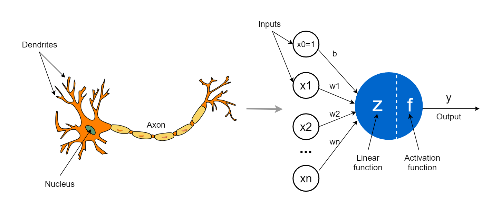
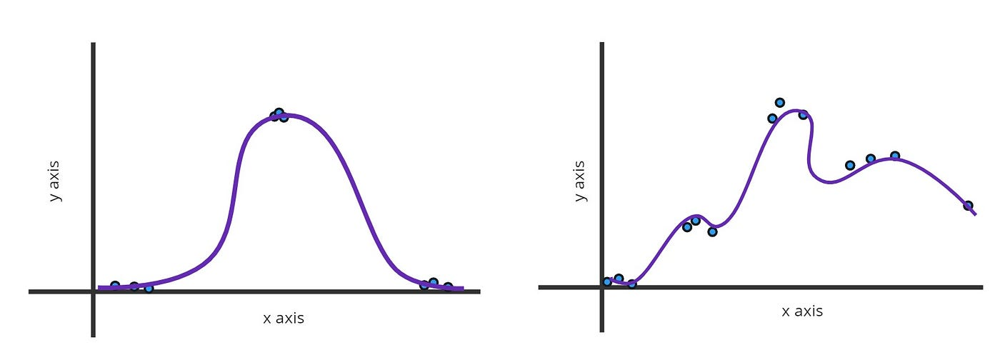
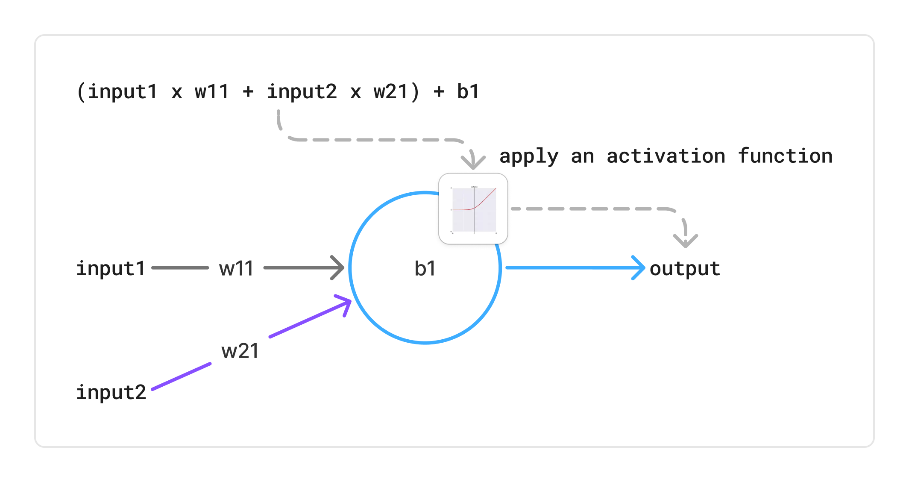

# Neural Networks

Neural Networks _(NN)_ are one of the most popular **Algorithms** in **Machine Learning** _(ML)_. They are inspired by the structure and function of the human brain, consisting of interconnected nodes **(neurons)** that *process* and *transmit* information.

## Role of NN in ML

Based on the data provided, NN can learn to recognize *patterns* and *relationships* within the data. They do that by **Fitting** a *Squiggly Line* through the data points, to represent the output variable the best way possible based on the input variables. This process is called **Training** the NN.

The core unity of a NN is the **Neuron** _(Perceptron)_. A Full NN consists of multiple layers of neurons: 
- **Input Layer**: Receives the input data.
- **Hidden Layers**: Perform computations and extract features from the input data.
- **Output Layer**: Produces the final output or prediction.

## Perceptron Structure

The Perceptron has been invented back in the 1950s by Frank Rosenblatt. It consists of multiple **inputs**, each associated with a **weight** and a **bias** term. The perceptron computes a weighted sum of the inputs, adds the bias, and applies an **activation function** for Nonlinearity.

The perceptron has to **learn** its weights and bias in order to make accurate predictions _(output)_ based on the input data and the desired output. This learning process is called **Training** the Perceptron.

## Training Steps

The training process of a neural network involves several key steps:

1. **Forward Propagation**: The input data is passed through the network layer by layer, with each neuron applying its weights, bias, and activation function to compute the output.
2. **Loss Calculation**: The network's output is compared to the actual target values using a **Loss Function** to measure the error or difference between the predicted and actual values. _(See [Cost Functions](./cost-functions) for more details.)_
3. **Backward Propagation**: The error is propagated backward through the network to compute the **gradients** of the loss with respect to the weights and biases using the **Chain Rule** of calculus. _(See [Backpropagation](./backpropagation) for more details.)_
4. **Weight Update**: The weights and biases are updated using an optimization algorithm (e.g., **Gradient Descent**) to minimize the loss. This involves adjusting the weights in the direction that reduces the error. _(See [Backpropagation](./backpropagation) for more details.)_
5. **Iteration**: Steps 1-4 are repeated for multiple **epochs** (iterations) until the network converges to a satisfactory level of accuracy.

