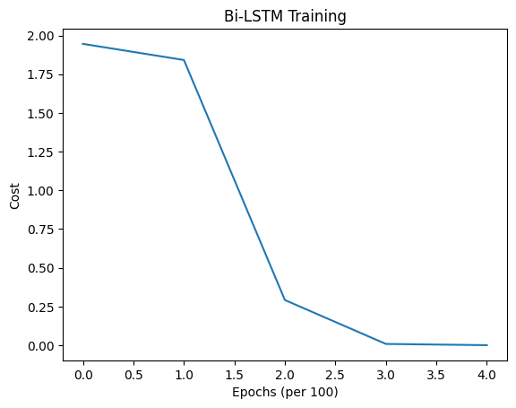

# Bi-LSTM First Application

We apply the new architecture **Bi-LSTM** on the **same** example as we did with the **LSTM** and **GRU** applications.

## Python Implementation

```python
import numpy as np
import matplotlib.pyplot as plt

class LSTM:
    def __init__(self, hidden_size, vocab_size):
        # ...
        pass

    def _sigmoid(self, z):
        # ...
        pass

    def _tanh(self, z):
        # ...
        pass

    def _softmax(self, z):
        # ...
        pass

    def _sigmoid_derivative(self, z):
        # ...
        pass

    def _tanh_derivative(self, z):
        # ...
        pass

    def forward(self, inputs, h_prev, c_prev):
        # ...
        pass
    
    def compute_cost(self, y_preds, targets):
        # ...
        pass

    def backpropagation(self, targets, cache):
        # ...
        pass

    def update_parameters(self, learning_rate=0.01):
        # ...
        pass

    def sample(self, seed_idx, h_prev, c_prev, length=20):
        # ...
        pass

class BiLSTM:
    def __init__(self, hidden_size, vocab_size, learning_rate=0.01):
        # ...
        pass
    
    def _softmax(self, z):
        # ...
        pass

    def forward(self, inputs, h_prev_f, c_prev_f, h_prev_b, c_prev_b):
        # ...
        pass

    def compute_cost(self, ys, targets):
        # ...
        pass

    def backpropagation(self, targets, cache):
        # ...
        pass

    def _lstm_backprop_manual(self, lstm, dh_seq, cache, T):
        # ...
        pass
    
    def update_parameters(self):
        # ...
        pass
    
    def _lstm_update_manual(self, lstm):
        # ...
        pass


# 1. Prepare Data
data = "helloahmed"
chars = list(set(data))
vocab_size = len(chars)
char_to_idx = { ch:i for i,ch in enumerate(chars)}
idx_to_char = { i:ch for i,ch in enumerate(chars)}

print(f"Data: {data}")
print(f"Vocab Size: {vocab_size}")


# 2. Create Model
hidden_size = 25
learning_rate = 0.01
epochs = 1000 # Fewer epochs needed because Bi-LSTM learns very fast

bilstm = BiLSTM(hidden_size, vocab_size, learning_rate)

# 3. Training Loop
print("Training Bi-LSTM...")
costs = []

inputs = [char_to_idx[ch] for ch in data[:-1]]
targets = [char_to_idx[ch] for ch in data[1:]]

for epoch in range(epochs):
    # Initialize states for BOTH LSTMs
    h_prev_fwd = np.zeros((hidden_size, 1))
    c_prev_fwd = np.zeros((hidden_size, 1))
    h_prev_bwd = np.zeros((hidden_size, 1))
    c_prev_bwd = np.zeros((hidden_size, 1))

    # Forward pass
    y_preds, cache = bilstm.forward(inputs, h_prev_fwd, c_prev_fwd, h_prev_bwd, c_prev_bwd)

    # Compute cost
    cost = bilstm.compute_cost(y_preds, targets)
    
    # Backpropagation
    bilstm.backpropagation(targets, cache)

    # Update parameters
    bilstm.update_parameters()
    
    if epoch % 100 == 0:
        print(f"Epoch {epoch}, Cost: {cost:.4f}")
        costs.append(cost)

print("Training complete.")

plt.plot(np.squeeze(costs))
plt.ylabel('Cost')
plt.xlabel('Epochs (per 100)')
plt.title(f"Bi-LSTM Training")
plt.show()
```
## Output and Comment



```
Data: helloahmed
Vocabulary: ['h', 'e', 'a', 'm', 'o', 'l', 'd']
Vocab Size: 7

Training Bi-LSTM...
Epoch 0, Cost: 1.9458
Epoch 100, Cost: 1.8416
Epoch 200, Cost: 0.2916
Epoch 300, Cost: 0.0082
Epoch 400, Cost: 0.0003
Training complete.


Sampling from the model:
Generated text: 'heddddddddd'
```

### The Cheating Effect

The Bi-LSTM achieved an extremely low training cost _(almost zero)_ very quickly _(after 400 epochs)_. This might look like "amazing" performance, but it's an **illusion**.

- **Reason**: The Backword LSTM reads the sentence from right-to-left.
- **Scenario**: Suppose the input is "hello".
    - At time $t=0$, we input "h" and want to predict "e".
    - The **Forward** LSTM sees "h". It has to guess "e".
    - The **Backward** LSTM reads the whole sequence in reverse: "o" -> "l" -> "l" -> "e" -> "h".
    - At the step corresponding to $t=0$ _(which is its last step)_, the Backward LSTM has **already seen** "e" _(and the "l", "l", "0")_.
    - It essentially **whispers** the answer to the output layer.

So, the model isn't learning to _predict_ the next character based on context; it's learning to _retrieve_ the character that the Backword layer just saw.

### The Generation Failure

When we run the **sample** method:
- We **turn off** the Backward LSTM _(feeding it zeros)_ because we don't know the future.
- We are now asking the Forward LSTM to do the job alone.
- **BUT**: The Forward LSTM got **lazy** during training! It relied on the Backward LSTM to give it the answers. It never learned strong predictive patterns on its own.
- **Result**: The generated text will likely be **nonesense**, even though the training cost was near zero.

:::tip 

- **Bi-LSTM** better for understanding **complete text** _(Translation, Sentiment)_.
- **Standard LSTM/GRU** better for **generating text** _(Chatbots, Autocomplete)_.

:::

## Notebook

You can find the interactive notebook [here](https://gist.github.com/AhmedCoolProjects/7253fafbc96315bcbbb07366e614f689).

