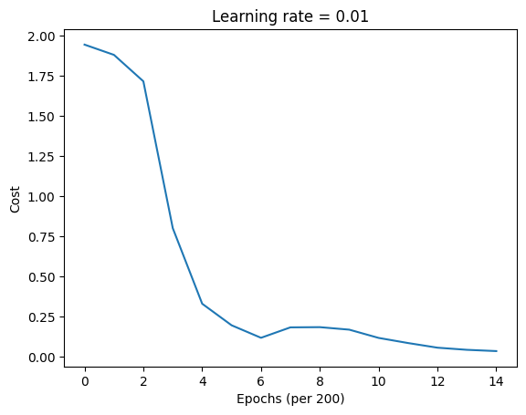

# GRU First Application

Here we follow the same application from the RNN first one, predicting the next character in the sequence 'helloahmed'. However, this time we will implement it using an LSTM architecture instead of a simple RNN.

## Python Implementation
```python
import numpy as np
import matplotlib.pyplot as plt

class GRU:
    def __init__(self, hidden_size, vocab_size, learning_rate=0.01):
        # ...
        pass

    def _sigmoid(self, z):
        # ...
        pass

    def _sigmoid_derivative(self, a):
        # ...
        pass

    def _tanh(self, z):
        # ...
        pass

    def _tanh_derivative(self, a):
        # ...
        pass
    
    def _softmax(self, z):
        # ...
        pass

    def forward(self, inputs, h_prev):
        # ...
        pass

    def compute_cost(self, ys, targets):
        # ...
        pass

    def backpropagation(self, targets, cache):
        # ...
        pass
    
    def update_parameters(self):
        # ...
        pass
    
    def sample(self, seed_idx, h_prev, length=20):
        # ...
        pass

# 1. prepare data
data = "helloahmed"
chars = list(set(data))
vocab_size = len(chars)
char_to_idx = { ch:i for i,ch in enumerate(chars)}
idx_to_char = { i:ch for i,ch in enumerate(chars)}

print(f"Data: {data}")
print(f"Vocabulary: {chars}")
print(f"Vocab Size: {vocab_size}")

# 2. create model
hidden_size = 25
epochs = 3000
learning_rate = 0.01

gru = GRU(hidden_size, vocab_size, learning_rate)

# 3. training loop
print("Training GRU...")
costs = []

inputs = [char_to_idx[ch] for ch in data[:-1]] # all chars except last
targets = [char_to_idx[ch] for ch in data[1:]] # all chars except first

for epoch in range(epochs):
    # We reset the memory at the start of each epoch
    h_prev = np.zeros((hidden_size, 1))

    # Forward pass
    y_preds, h_final, cache = gru.forward(inputs, h_prev)

    cost = gru.compute_cost(y_preds, targets)

    gru.backpropagation(targets, cache)

    gru.update_parameters()

    if epoch % 200 == 0:
        print(f"Epoch {epoch}, Cost: {cost}")
        costs.append(cost) # Append cost for plotting

print("Training complete.")

plt.plot(np.squeeze(costs))
plt.ylabel('Cost')
plt.xlabel('Epochs (per 200)')
plt.title(f"Learning rate = {0.01}")
plt.show()

# Test the model (sampling)
print("\nSampling from the model:")
# Get the index for our seed character 'h'
seed_char_idx = char_to_idx['h']

h_sample = np.zeros((hidden_size, 1))

generated_indices = gru.sample(seed_char_idx, h_sample, length=10)
generated_text = 'h' + ''.join(idx_to_char[idx] for idx in generated_indices)

print(f"Generated text: '{generated_text}'")
```

## Output

```
Training GRU...
Epoch 0, Cost: 1.9459141102092898
Epoch 200, Cost: 1.8820941376017426
Epoch 400, Cost: 1.7173890355162649
Epoch 600, Cost: 0.8028859557757452
Epoch 800, Cost: 0.3321508924395241
Epoch 1000, Cost: 0.1979177453568896
Epoch 1200, Cost: 0.11995815684712927
Epoch 1400, Cost: 0.18499005840229943
Epoch 1600, Cost: 0.18629243670532064
Epoch 1800, Cost: 0.17070964217578966
Epoch 2000, Cost: 0.11924944862850778
Epoch 2200, Cost: 0.0873657902096159
Epoch 2400, Cost: 0.05842180501814652
Epoch 2600, Cost: 0.04516581113149621
Epoch 2800, Cost: 0.03725497325100427
Training complete.


Sampling from the model:
Generated text: 'helloahmedd'
```



:::tip LSTM vs GRU

We can see the results is quite similar to the LSTM implementation. GRUs are generally faster to train and require less memory, making them a good alternative to LSTMs in many applications. However, the choice between LSTM and GRU often depends on the specific task and dataset.

:::

## Notebook

You can find the complete implementation in this [Jupyter Notebook](https://gist.github.com/AhmedCoolProjects/09c3bb6b1950f744047585e2ed629101).