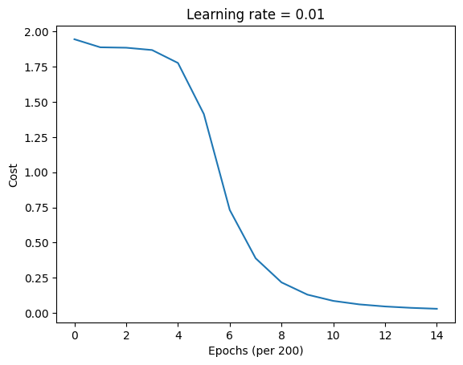

# LSTM First Application 

Here we follow the same application from the RNN first one, predicting the next character in the sequence 'helloahmed'. However, this time we will implement it using an LSTM architecture instead of a simple RNN.

## Python Implementation

```python
import numpy as np
import matplotlib.pyplot as plt

class LSTM:
    def __init__(self, hidden_size, vocab_size):
        # ...
        pass

    def _sigmoid(self, z):
        # ...
        pass

    def _tanh(self, z):
        # ...
        pass

    def _softmax(self, z):
        # ...
        pass

    def forward(self, inputs, h_prev, c_prev):
        # ...
        pass
    
    def compute_cost(self, y_preds, targets):
        # ...
        pass

    def backpropagation(self, targets, cache):
        # ...
        pass

    def update_parameters(self, learning_rate=0.01):
        # ...
        pass

    def sample(self, seed_idx, h_prev, c_prev, length=20):
        # ...
        pass

# 1. prepare data
data = "helloahmed"
chars = list(set(data))
vocab_size = len(chars)
char_to_idx = { ch:i for i,ch in enumerate(chars)}
idx_to_char = { i:ch for i,ch in enumerate(chars)}

print(f"Data: {data}")
print(f"Vocabulary: {chars}")
print(f"Vocab Size: {vocab_size}")

# 2. create model
hidden_size = 25
epochs = 3000

lstm = LSTM(hidden_size, vocab_size)

# 3. training loop
print("Training LSTM...")
costs = []

inputs = [char_to_idx[ch] for ch in data[:-1]] # all chars except last
targets = [char_to_idx[ch] for ch in data[1:]] # all chars except first

for epoch in range(epochs):
    # We reset the memory at the start of each epoch
    h_prev = np.zeros((hidden_size, 1))
    c_prev = np.zeros((hidden_size, 1))

    # Forward pass
    y_preds, h_final, c_final, cache = lstm.forward(inputs, h_prev, c_prev)

    cost = lstm.compute_cost(y_preds, targets)

    lstm.backpropagation(targets, cache)

    lstm.update_parameters()

    if epoch % 200 == 0:
        print(f"Epoch {epoch}, Cost: {cost}")
        costs.append(cost) # Append cost for plotting

print("Training complete.")

plt.plot(np.squeeze(costs))
plt.ylabel('Cost')
plt.xlabel('Epochs (per 200)')
plt.title(f"Learning rate = {0.01}")
plt.show()

# Test the model (sampling)
print("\nSampling from the model:")
# Get the index for our seed character 'h'
seed_char_idx = char_to_idx['h']

h_sample = np.zeros((hidden_size, 1))
c_sample = np.zeros((hidden_size, 1))

generated_indices = lstm.sample(seed_char_idx, h_sample, c_sample, length=10)
generated_text = 'h' + ''.join(idx_to_char[idx] for idx in generated_indices)

print(f"Generated text: '{generated_text}'")
```

## Output

```
Training LSTM...
Epoch 0, Cost: 1.9459308553119037
Epoch 200, Cost: 1.888694596930537
Epoch 400, Cost: 1.885747141311822
Epoch 600, Cost: 1.869165401158513
Epoch 800, Cost: 1.7772037343293763
Epoch 1000, Cost: 1.4138688219022517
Epoch 1200, Cost: 0.7320503793476106
Epoch 1400, Cost: 0.3883764333872252
Epoch 1600, Cost: 0.21691620735344425
Epoch 1800, Cost: 0.12986328517492585
Epoch 2000, Cost: 0.08541260344701034
Epoch 2200, Cost: 0.06066953628544073
Epoch 2400, Cost: 0.04568582684125432
Epoch 2600, Cost: 0.035955796413271686
Epoch 2800, Cost: 0.029270449962368588
Training complete.


Sampling from the model:
Generated text: 'helloahmedl'
```



:::tip RNN vs. LSTM
The same application using a simple RNN architecture resulted in the generated text '**hmedlloahme**', which is less accurate than the LSTM's output '**helloahmedl**'. This demonstrates the LSTM's superior ability to capture long-term dependencies in sequences.
:::

## Notebook

You can find an interactive Jupyter Notebook version of this implementation [here](https://gist.github.com/AhmedCoolProjects/a0fc5bc563c2ca38dc5437c3e6a27932).