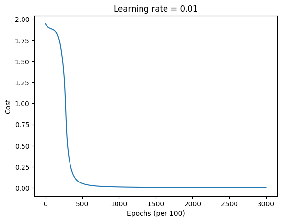

# RNN First Application

For this RNN example, we will create a simple corpus of repeated words 'helloahmed' without spaces. The goal of the RNN will be to predict the next character in the sequence given the previous characters. This is a common task in sequence modeling and language modeling.

## Python Implementation

```python
import matplotlib.pyplot as plt

class RNN:
    def __init__(self, hidden_size, vocab_size, learning_rate=0.01):
        # ...
        pass

    def _softmax(self, x):
        # ...
        pass
    
    def forward(self, inputs, h_prev):
        # ...
        pass

    def compute_cost(self, y_preds, targets):
        # ...
        pass

    def backpropagation(self, targets, cache):
        # ...
        pass
        
    def update_parameters(self):
        # ...
        pass

    def sample(self, seed_idx, h_prev, length=20):
        # ...
        pass

# 1. prepare data
data = "helloahmed"
chars = list(set(data))
vocab_size = len(chars)
char_to_idx = { ch:i for i,ch in enumerate(chars)}
idx_to_char = { i:ch for i,ch in enumerate(chars)}

print(f"Data: {data}")
print(f"Vocabulary: {chars}")
print(f"Vocab Size: {vocab_size}")

# 2. create model
hidden_size = 25
learning_rate = 0.01
epochs = 3000

rnn = RNN(hidden_size, vocab_size, learning_rate)

# 3. training loop
print("Training RNN...")
costs = []
h_prev = np.zeros((hidden_size, 1))
inputs = [char_to_idx[ch] for ch in data[:-1]] # all chars except last
targets = [char_to_idx[ch] for ch in data[1:]] # all chars except first

for epoch in range(epochs):
    # Forward pass
    y_preds, h_prev, cache = rnn.forward(inputs, h_prev)
    
    # Compute cost
    cost = rnn.compute_cost(y_preds, targets)
    costs.append(cost)
    
    # Backpropagation
    rnn.backpropagation(targets, cache)
    
    # Update parameters
    rnn.update_parameters()
    
    if epoch % 50 == 0:
        print(f"Epoch {epoch}, Cost: {cost}")

print("Training complete.")

# Test the model (sampling)
# Get the index for our seed character 'h'
seed_char_idx = char_to_idx['h']
h_sample = np.zeros((hidden_size, 1))
generated_indices = rnn.sample(seed_char_idx, h_sample, length=10)
generated_text = 'h' + ''.join(idx_to_char[idx] for idx in generated_indices)

print(f"Generated text: {generated_text}")

# --- 5. Plot the Cost ---
plt.plot(np.squeeze(costs))
plt.ylabel('Cost')
plt.xlabel('Epochs (per 100)')
plt.title(f"Learning rate = {learning_rate}")
plt.show()
```

## Output

```
Training RNN...
Epoch 0, Cost: 1.9459309991147857
Epoch 200, Cost: 1.706202022211689
Epoch 400, Cost: 0.12627818855498268
Epoch 600, Cost: 0.0324479532281581
Epoch 800, Cost: 0.017277991429821452
Epoch 1000, Cost: 0.011609467854989664
Epoch 1200, Cost: 0.00869695286268516
Epoch 1400, Cost: 0.006935226399796615
Epoch 1600, Cost: 0.005758547578169212
Epoch 1800, Cost: 0.004918524861098574
Epoch 2000, Cost: 0.004289487960648133
Epoch 2200, Cost: 0.00380120066255434
Epoch 2400, Cost: 0.003411396816110657
Epoch 2600, Cost: 0.0030931462666720904
Epoch 2800, Cost: 0.0028284911266208226
Training complete.

Generated text: hmedlloahme
```



## Notebook

You can find an interactive Jupyter Notebook version of this implementation [here](https://gist.github.com/AhmedCoolProjects/572dd81226fccaeec8805bc6dad5d130).