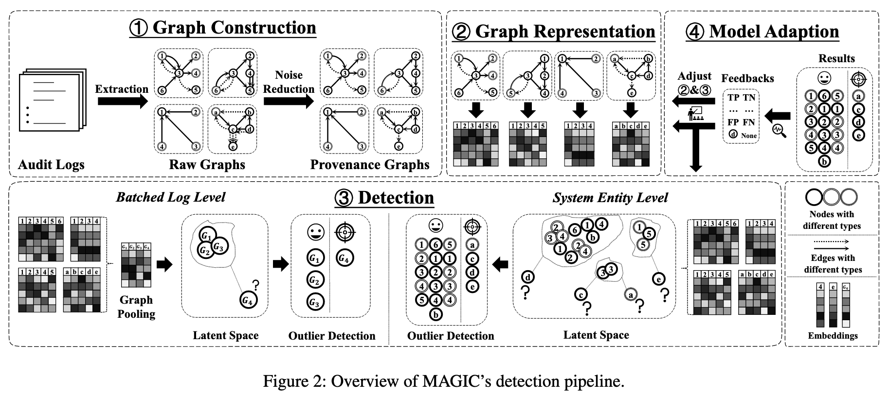

# MAGIC'24 USENIX

## Prerequisites

To deconstruct this paper effectively, we will need three foundations:

- **Provenance Graphs** that you can check [here](./provenance-graph)
- **Graph Attention Networks (GAT)** you can check them [here](./../../graphs/gat)
- **Graph Masked Autoencoders (GMAE)** available also [here](./../../graphs/graph-mae)

To have an idea about what datasets being used and the difference between them:
- **Streamspot** that you can check [here](./../../datasets/apt/system-logs/streamspot)
- **DARPA TC E3** and **CDM v.18 Schema** that you can check [here](./../../datasets/apt/system-logs/darpa-tc-e3)
## Problem State & Motivation

In the introduction, the authors identified three major limitations of existing approaches _(Supervised, Statistic-based and DL-based)_:

#### Supervised

The authors highlighted two critical weaknesses of using **Supervised Learning** for this kind of security:

- **Lack-Of-Data (LOD)**: Real APT attacks are rare, so there are not enough labeled example to train supervised models on.
- **Vulnerability to New Types**: Supervised models are essentially pattern-matchers. If an attack doesn't match the specific patterns the model was trained on _(like a "zero-day" or a new variant)_, the model is blind to it.

This puts us in a bind: We can't train the model on attacks because we don't have enough data, and even if we did, it wouldn't catch the _next_ new attack.

**The Solution: Flipping the Script**

Since we can't effectively model the **attacks**, the authors proposed to model **benign _(normal)_ behavior** instead.
MAGIC learns to be an expert on what "healthy" system activity looks like. Anything that deviates from that standard is flagged as suspicious. This approach is formally called **Anomaly Detection**.

#### Statistic-based

According to the paper, **Statistic-based** approaches _(which use things like rarity or anomaly scores)_. have three main weaknesses:

- **Rarity $\neq$ Malice**: They assume that if a system entity _(like a process or file)_ is "rare," it is likely malicious. The authors argue this is often false; many benign system behaviors are rare but safe.
- **Shallow Understanding**: These methods perform **shallow feature extraction**. They look at surface-level numbers but fail to understand the **deep semantics** or the story behind the data.
- **High False Positives**: Because they flag things based on simple rarity without understanding the context, they tend to raise too many false alarms _(False Positives)_.

**The Solution: Deep Graph Representation Learning**

Graph Representation Module converts system entities into **embeddings** which captures complex, multi-dimensional information about _what_ the entity is and _how_ it behaves. It also captures **contextual information** to understand the full story.

#### DL-based

While DL-based methods are powerful, the authors point out a major practical flaw that often prevents them from being used in the real world. The primary issues are related to **effeciency** and **resources**.

- **Computational Overhead**: Existing _Graph-based_ and _Sequence-based_ DL methods are extremely "heavy". In a real entreprise, hundreds of gigabytes of logs are produced daily. Processing such a large volume with standard DL models is often too slow to be practical. (For example **ATLAS** takes about _1 hour_ to train on $676Mb$ of logs, and **ShadeWatcher** takes _1 day_ to train on DARPA dataset even with a GPU.)
- **Memory Consumption**: Some Graph Auto-Encoder approaches suffer from "Explosive Memory Overhead" as the graph gets larger _(scalling issues)_.

**The Solution: Effeciency Through Masking**

MAGIC addresses these resource problems directly with it **Masked Graph Auto-Encoder (MGAE)** architecture.

## MAGIC Architecture

Now that we know MAGIC's strategy is to learn benign behavior efficiently, we need to understand its architecture. The _Figure 2_ _(below)_ provides the roadmap for this process.

### 1. Graph Construction

**Turning raw logs into a structured graph**

Real-world audit logs are just massive list of text lines. Before the AI can learn anything, MAGIC needs to turn these lists into a clean **Provenance Graph**.

According to **§4.1 (Provenance Graph Construction)**, the process is divided into three distinct steps:

1. **Log Parsing**: Extracting entities and interactions from the raw text logs to build a "prototype" graph. After extraction, we normalize the different ways of representing the same entity or interaction. For instance, a raw log might show `sys_open`, `sys_openat` or `sys_creat`, but we normalize them all under a single abstract edge type `OPEN`. The result of this step is a **Provenance Graph** where nodes are entities defined with attributes _(or ID)_ and types, along with edges defined by types.
2. **Initial Embeddings**: Converting the labels of these nodes and edges into feature vectors.
3. **Noise Reduction**: Cleaning up the graph to make it efficient.

### 2. Graph Representation

**The "brain" MGAE that learns the embeddings**

### 3. Detection

**The "judge" that spots the outliers**

## Reference

- [Magic'24 USENIX Paper](https://www.usenix.org/system/files/usenixsecurity24-jia-zian.pdf)
