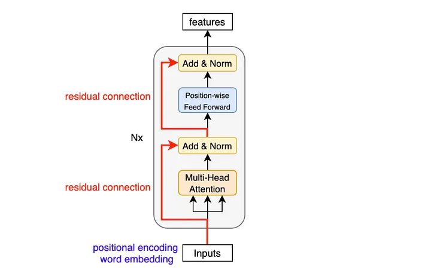
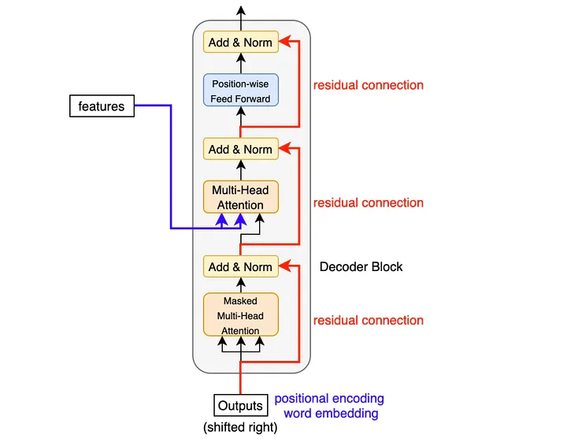

# Encoder-Decoder Architecture

This of this architecture as a team of two experts working together on a translation task. (e.g., English to French translation)

1. **Encoder _(The Reader)_**: This stack of layers reads the entire input sentence at once. Its job is to understand the context, grammar, and meaning of every word relative to every other word. It packages all this understanding into a rich set of memory vectors _(Context)j_.
2. **Decoder _(The Writer)_**: This stack generates the output sentence, one word at a time. It constantly looks back at the Encoder's memory to see which parts of the input are relevant for the word it's currently writing.

## Encoder

The Encoder's job is to ingest the raw sequence and output a rich, context-aware representation of every word. It does this by passing the data through a stack of $N$ **identical layers** _(usually 6 in the original paper)_.


Each of these layers has the same internal structure. It takes the list of word vectors from the previous layer, polishes them, and passes them up to the next layer.

Here is what happens inside **one single Encoder layer**:



### 1. Multi-Head Self-Attention

**The Mixing Phase: Multi-Head Self-Attention**

First the vectors enter the **Multi-Head Attention** mechanism.
    - **Input**: Word vectors that capture words's meaning in isolation _(or from previous layer)_.
    - **Action**: The model gathers context by looking at all other words and updates the words vectors.
    - **Output**: New vectors that are now **context-aware**.

### 2. FFN
**The Processing Phase: Position-wise Feed-Forward Network _(FFN)_**

Next, these **context-aware** vectors are passed to a standard **Feed-Forward Network**.
    - **Action**: It applies two linear transformations with a ReLU activation in between:
    $$ ReLU(x \cdot W_1 + b_1) \cdot W_2 + b_{2} $$
    - **Crucial Detail**: This network is applied to **each position separately and identically**. It doesn't mix information between words _(Attention already did that)_. It just processes each word's new "mixed" vector individually to extract deeper features.

### 3. Add & Norm

**The Glue: "Add & Norm"**

We notice in the diagram that there are lines going around each sub-layer. These are **Residual Connections** _(the "Add")_, followed by **Layer Normalization** _(the "Norm")_.

The math looks like this: $Output = LayerNorm(x + Sublayer(x))$

- **Add**: We take the original input vector $x$ _(before it went through attention or FFN)_ and add it to the output.

    When we train very deep networks _(like the Transformers)_, which can have dozens of layers, the signal often gets weaker and weaker as it passes through each layer. By the time we get to the end, the signal might be tiny _(the **vanishing gradient** problem)_.

    By adding the original input $x$ to the output $(x + Layer(x))$, we create a **shortcut** or a **superhighway** for the gradient.
        > Even if the layer's transformation makes the signal tiny or messy, the gradient can flow backward through the $+x$ connection unchanged _(because the derivative of $x$ is just $1$)_.
        >
        > This ensures the model always has a clear path to learn, no matter how deep it gets.

- **Norm**: We normalize the result to keep the numbers stable.
    
    After we add the residual $(x + Output)$, the numbers in our vector might get huge or shift around weirdly. Layer Norm fixes this by:

    1. **Centering**: Moving the numbers so their average is $0$ _(subtracting the mean)_.
    2. **Scaling**: Adjusting them so they have a standard variance _(spread)_.

    This keeps the math stable and prevents the values from exploding as they travel up the stack.

### Summary

So the Encoder does this loop $N$ times:
1. **Self-Attention**: "Look at other words to understand the context"
2. **Add & Norm**: "Remember my original meaning and stay stable"
3. **FFN**: "Process this new context to extract deeper patterns"
4. **Add & Norm**: "Stabilize again"

After $6$ of these layers, we have a rich, deep understanding of the English sentence.

Now, we need to translate that into French.

## Decoder

The Decoder is very similar to the Encoder, but it has a few special tweaks to handle genererating text one word at a time.



The Decoder stack also has $N$ identical layers. However, inside each layer, there are **three** sub-layers instead of two.

Let's look at the flow of data when we are translating "The bank ..." into French _("La banque...")_.

### 1. Masked Self-Attention

**The "No Peeking" Rule**

The first sub-layer is **Self-Attention**, just like in the Encoder, but with a twist.

When the model is training, we feed it the correct French sentence ("La banque..."). However, when it's trying to predict the word "banque" _(at position 2)_, it shouldn't be allowed to "see" the future words at positions 3, 4, etc.

- **The Mask**: We force the attention scores for all future words to be $-\infty$ _(or a very small number)_.
- **The Result**: When the softmax is applied, those future positions turn into $0$. The model can only pay attention to earlier words ("La").

### 2. Encoder-Decoder Attention

**The Bridge**

This is the new, third sub-layer inserted in the middle. It connects the two stacks.

- **Goal**: The Decoder says, "I am currently writing 'banque'. Which parts of the English sentence _(Encoder output)_ are relevant to me right now?"
- **The Mechanics**:
    - **Query _($Q$)_**: Come from the **Decoder** _(from the previous sub-layer)_. This represents "what I am trying to translate now".
    - **Keys _($K$)_ and Values _($V$)_**: Come from the **Encoder** _(its final output memory)_. This represents "the source material".

By using its own Query to search against the Encoder's Keys, the Decoder can focus on 'bank' and 'river' in the source sentence exactly when it needs to generate 'banque' in the target sentence.

### 3. Feed-Forward Network

Finally, the data goes through the standard Feed-Forward Network _(FFN)_ and "Add & Norm" layers.

At the very top of the stack, the final vector is passed through a **Linear Layer** _(to expand it to the size of the entire French vocabulary)_ and a **Softmax** _(to turn those numbers into probabilities)_. The word with the highest probability is chosen as the next word.

## Python Implementation

```python title="Feed Forward Network"
import numpy as np

class FeedForwardNetwork:
    def __init__(self, d_model, d_ff):
        self.W1 = np.random.randn(d_model, d_ff) * 0.01
        self.b1 = np.zeros((1, d_ff))
        self.W2 = np.random.randn(d_ff, d_model) * 0.01
        self.b2 = np.zeros((1, d_model))

    def relu(self, z):
        return np.maximum(0, z)
    
    def forward(self, x):
        # x: shape (m, s, d)
        # Linear 1 -> ReLU -> Linear 2
        return np.dot(self.relu(np.dot(x, self.W1) + self.b1), self.W2) + self.b2
```

```python title="Normalization"
import numpy as np

class LayerNormalization:
    def __init__(self, d_model, eps=1e-6):
        self.gamma = np.ones(d_model) # Learnable scale
        self.beta = np.zeros(d_model) # Learnable shift
        self.eps = eps

    def forward(self, x):
        mean = np.mean(x, axis=-1, keepdims=True)
        std = np.std(x, axis=-1, keepdims=True)
        return self.gamma * (x - mean) / (std + self.eps) + self.beta
```

```python title="Encoder Layer"
import numpy as np

class EncoderLayer:
    def __init__(self, d_model, num_heads, d_ff, dropout=0.1):
        self.d = d_model
        self.n = num_heads
        self.d_ff = d_ff
        self.dropout = dropout

        self.mha = MultiHeadAttention(d_model, num_heads)
        self.ffn = FeedForwardNetwork(d_model, d_ff)
        self.ln1 = LayerNormalization(d_model)
        self.ln2 = LayerNormalization(d_model)

        # Note: Dropout is usually applied here, but we'll skip it for simplicity.

    def forward(self, x, mask=None):
        # 1. Self-Attention
        attn_out, _ = self.mha.forward(x, x, x, mask)
        # 2. Add & Norm
        out1 = self.ln1.forward(x + attn_out)
        # 3. Feed-Forward
        ffn_out = self.ffn.forward(out1)
        # 4. Add & Norm
        out2 = self.ln2.forward(out1 + ffn_out)
        return out2
```


```python title="Transformer Encoder"
import numpy as np

class TransformerEncoder:
    def __init__(self, num_layers, d_model, num_heads, d_ff, input_vocab_size, max_len=5000):
        self.d = d_model
        self.n = num_heads
        self.d_ff = d_ff
        self.max_len = max_len
        self.L = num_layers

        # Embedding Layer
        self.embedding = np.random.randn(input_vocab_size, d_model) * 0.01
        # PE
        self.pe = self._get_positional_encoding(max_len, d_model)
        # Stack of N Encoder Layers
        self.layers = [EncoderLayer(d_model, num_heads, d_ff) for _ in range(num_layers)]

    def _get_positional_encoding(self, max_len, d_model):
        pe = np.zeros((max_len, d_model))
        pos = np.arange(0, max_len).reshape(-1, 1)
        div_term = np.exp(np.arange(0, d_model, 2) * -(np.log(10000.0) / d_model))

        pe[:, 0::2] = np.sin(pos * div_term)
        pe[:, 1::2] = np.cos(pos * div_term)
        return pe

    def forward(self, x, mask=None):
        '''
        x: Input tokens (m, s)
        '''
        # 1. Embedding
        x = self.embedding[x]
        # 2. Scale Embeddings (Standard Transformer trick)
        x = x * np.sqrt(self.d_model)
        # 3. Add PE
        seq_len = x.shape[1]
        x = x + self.pe[:seq_len, :]

        # 4. Pass through N Layers
        for layer in self.layers:
            x = layer.forward(x, mask)
        
        return x # Final Context Vectors
```

**Quick Test**

```python title="Quick Test"
import numpy as np

d_model = 512
num_heads = 8
num_layers = 6
d_ff = 2048
vocab_size = 10000

# Create the encoder
encoder = TransformerEncoder(num_layers, d_model, num_heads, d_ff, vocab_size)
sample_input = np.random.randint(0, vocab_size, size=(2, 10))

# Forward pass
context_vectors = encoder.forward(sample_input)

print("Input tokens shape:", sample_input.shape)
print("Context vectors shape:", context_vectors.shape)
print("Test Passed! The output vectors are now context-aware.")
```

```python title="Decoder Layer"
import numpy as np

class DecoderLayer:
    def __init__(self, d_model, num_heads, d_ff, dropout=0.1):
        # 1. Masked Self-Attention
        self.mha1 = MultiHeadAttention(d_model, num_heads)
        self.ln1 = LayerNormalization(d_model)

        # 2. Cross-Attention
        self.mha2 = MultiHeadAttention(d_model, num_heads)
        self.ln2 = LayerNormalization(d_model)

        # 3. Feed-Forward
        self.ffn = FeedForwardNetwork(d_model, d_ff)
        self.ln3 = LayerNormalization(d_model)

    def forward(self, x, enc_output, look_ahead_mask, padding_mask):
        '''
        x: Decoder Input (m, target_seq_len, d_model)
        enc_output: Encoder output (m, input_seq_len, d_model)
        look_ahead_mask: Mask for self-attention (prevents seeing future tokens)
        padding_mask: Mask for cross-attention (prevents attending to padding in encoder input)
        '''
        # 1. Masked Self-Attention
        attn1, _ = self.mha1.forward(x, x, x, look_ahead_mask)
        # Add & Norm
        out1 = self.ln1.forward(x + attn1)

        # 2. Cross-Attention
        attn2, _ = self.mha2.forward(out1, enc_output, enc_output, padding_mask)
        # ADD & Norm
        out2 = self.ln2.forward(out1 + attn2)

        # 3. Feed-Forward
        ffn_out = self.ffn.forward(out2)
        out3 = self.ln3.forward(out2 + ffn_out)

        return out3

```

```python title="Transformer Decoder"
import numpy as np

class TransformerDecoder:
    def __init__(self, num_layers, d_model, num_heads, d_ff, target_vocab_size, max_len=5000):
        self.d = d_model
        self.L = num_layers

        self.embedding = np.random.randn(target_vocab_size, d_model) * 0.01
        self.pe = self._get_positional_encoding(max_len, d_model)

        self.layers = [DecoderLayer(d_model, num_heads, d_ff) for _ in range(num_layers)]

    def _get_positional_encoding(self, max_len, d_model):
        pe = np.zeros((max_len, d_model))
        pos = np.arange(0, max_len).reshape(-1, 1)
        div_term = np.exp(np.arange(0, d_model, 2) * -(np.log(10000.0) / d_model))

        pe[:, 0::2] = np.sin(pos * div_term)
        pe[:, 1::2] = np.cos(pos * div_term)
        return pe

    def forward(self, x, enc_output, look_ahead_mask, padding_mask):
        '''
        x: Target tokens (m, target_seq_len)
        '''
        # 1. Embedding
        x = self.embedding[x]
        x *= np.sqrt(self.d)

        # 2. PE
        seq_len = x.shape[1]
        x += self.pe[:seq_len, :]

        # 3. Pass through N layers
        for layer in self.layers:
            x = layer.forward(x, enc_output, look_ahead_mask, padding_mask)
        
        return x
```

```python title="Quick Test"
import numpy as np

d_model = 512
num_heads = 8
num_layers = 6
d_ff = 2048
target_vocab_size = 10000

decoder = TransformerDecoder(num_layers, d_model, num_heads, d_ff, target_vocab_size)

batch_size = 2
target_seq_len = 10
input_seq_len = 12

# Decoder Input (Target tokens shifted right)
sample_target = np.random.randint(0, target_vocab_size, size=(batch_size, target_seq_len))
# Encoder Output (Context from source sentence)
fake_enc_output = np.random.randn(batch_size, input_seq_len, d_model)

# Masks (Simplified for testing - normally we generate these)
# Look-ahead mask: Upper triangular matrix of -inf
look_ahead_mask = np.triu(np.ones((target_seq_len, target_seq_len)), k=1)
look_ahead_mask = np.where(look_ahead_mask == 1, 0, 1) # 1 for keep, 0 for hide
padding_mask = None

output = decoder.forward(sample_target, fake_enc_output, look_ahead_mask, padding_mask)

print("Decoder Input Shape:", sample_target.shape) # (2, 10)
print("Encoder Context Shape:", fake_enc_output.shape) # (2, 12, 512)
print("Decoder Output Shape:", output.shape)     # (2, 10, 512)
print("Test Passed! The decoder combined self-context with encoder-context.")
```